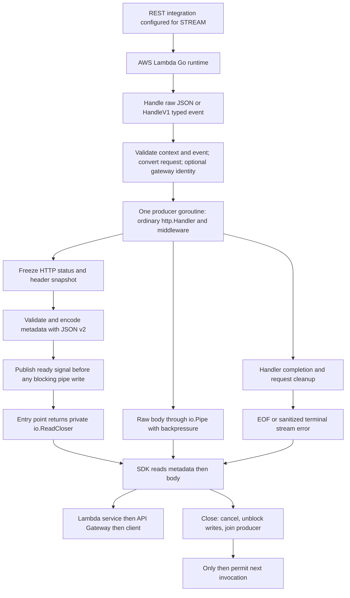

# 0009: Streaming entry points, ownership, and failure boundaries

Status: accepted by the user on 2026-09-14;
implemented with local validation.
Deployed SDK/API Gateway compatibility remains unverified.

The [2026-09-17 writer review](0022-streaming-writer-review.md) applies this accepted contract to the completed shared foundations.
Its refinements were approved on 2026-09-17 and implemented: no inferred streaming lengths and shared empty Content-Encoding sniffing.
Its local SDK probe observes connection reuse, extending the existing runtime compatibility question below.
Decision 0010 already resolved the conservative metadata-prefix implementation limit.

## Recommended public boundary

Keep a distinct adapter in the root edge package.
Accepted signatures:

```go
func NewStreaming(handler http.Handler, opts ...Option) (*StreamingAdapter, error)
func (a *StreamingAdapter) Handle(ctx context.Context, event jsontext.Value) (io.ReadCloser, error)
func (a *StreamingAdapter) HandleV1(ctx context.Context, event events.APIGatewayProxyRequest) (io.ReadCloser, error)
```

Register `lambda.Start(adapter.Handle)` or `lambda.Start(adapter.HandleV1)`.
Do not register the streaming adapter object via the byte-returning lambda.Handler interface.
No HandleV2: API Gateway HTTP APIs do not currently stream responses.
REST configuration is a deployment precondition;
a typed V1 event alone cannot prove the invoking API product.
Raw Handle rejects the explicitly versioned HTTP API envelopes supported by the separate buffered adapter.

Handle receives raw JSON via the standard jsontext.Value capture type and applies edge's direct JSON v2 decoding and validation.
The SDK still owns its initial capture step.
HandleV1 skips request JSON work.
Both must encode streaming metadata with JSON v2;
typed streaming cannot eliminate that wire prefix.

Reuse the existing Option type and immutable configuration, including the accepted WithGatewayIdentity default.
NewStreaming performs the same constructor validation as New and starts no goroutines or I/O.
The caller owns handler concurrency safety.
Do not add Start helpers, stream-specific request types, or a public ResponseWriter interface.

The concrete stream remains private and implements Read, Close, ContentType, and a MarshalJSON rejection method.
The latter follows the SDK streaming type's reader-dispatch pattern: it prevents accidental JSON serialization and lets the SDK consume the reader.
It does not perform JSON encoding.
ContentType returns the Lambda integration media type, independently of the application's HTTP Content-Type in the prefix.
Direct callers must consume and Close the stream.

## Design graph



The graph separates application HTTP commitment from handing a response stream to the runtime.
That handoff is our practical error boundary;
do not assume that the absence of an observed network write makes it safe to return a different result after handing off the reader.

## Ownership and lifecycle

| Owner | Responsibility |
| --- | --- |
| Entry point | Synchronous validation/conversion and optional gateway identity; start producer; wait for ready, failure, or cancellation |
| Producer goroutine | Run handler/middleware; own writer state; finalize body accounting; clean original request body and attached multipart form |
| Private stream | Own immutable prefix, pipe reader, cancellation, terminal read error, and producer completion signal |
| SDK runtime | Consume/close the returned stream and perform Runtime API transport |
| Application | Honor request cancellation and Write/Flush errors; authorize before sending content; own any goroutines it starts |

Use one producer, not a goroutine per write.
Publish a one-shot ready signal after prefix validation and before blocking on pipe output.
Otherwise the producer can wait for a reader while the entry point waits for the producer.
Do not share the handler's mutable Header map with the consumer.

Successful EOF must occur only after producer completion and request cleanup, so cleanup failures can still become terminal read errors.
Keep the invocation scope until consumption finishes or Close completes.
Refactor the shared scope into acquisition/cleanup primitives with the existing synchronous helper as one owner;
do not return a live stream from inside today's withInvocation callback.

Close is idempotent, safe to call concurrently with Read, and cancels the child context, closes the pipe's read side to unblock writes, then joins the producer.
Parent cancellation also closes the bridge so a writer blocked by a stalled consumer can exit.
A context.AfterFunc cancellation callback must be stopped or joined during teardown;
stopping it alone does not wait for an active callback.

Go cannot forcibly terminate a handler that ignores cancellation and write errors.
Close may wait for such a handler;
in Lambda the invocation timeout is the final bound.
Do not return early and silently leave that handler running into a warm invocation.
The guarantee is bounded adapter buffering and cleanup of cooperative handlers, not the ability to kill arbitrary application code.
[io.Pipe](https://pkg.go.dev/io#Pipe) [context.AfterFunc](https://pkg.go.dev/context#AfterFunc)

## Writer and framing behavior

- Share HTTP status/header validation where the contracts match.
  Preserve REST multivalue response fields rather than applying V2 comma-joining rules.
- First final WriteHeader, Write, or Flush commits status/header snapshot.
  Flush without a prior status commits 200.
  Subsequent header mutation does not alter the snapshot.
- Recommend retaining at most a 512-byte initial body prefix for content-type detection when needed, then using the unbuffered pipe.
  Publish on filling that prefix, explicit Flush, or handler completion.
  If type detection is suppressed or unnecessary, first nonempty Write can publish immediately.
  Empty Flush publishes metadata without inventing a type from absent body bytes.
- Implement Flush and FlushError so ResponseController.Flush can report failure.
  Flush drains edge's pending prefix/body bytes toward the SDK.
  It does not guarantee client receipt, packet boundaries, or intermediary flush timing.
- Use direct JSON v2 for the bounded prefix, followed by eight NUL bytes, then raw body bytes.
  Do not base64 encode the body or buffer it to infer length.
  Enforce AWS's documented first-16-KB framing requirement.
  Verify the precise byte-boundary interpretation before finalizing its numeric constant;
  this is distinct from the unapproved general metadata budgets in decision 0007.
- Honor supplied valid Content-Length and reject writes that exceed it before forwarding their excess.
  A short body discovered after handoff is a terminal stream error.
  Without a declared length, let the gateway provide framing.
- Capture the original method.
  Suppress HEAD bodies and 204/205/304 bodies;
  retain the accepted forbidden-write conventions.
  Do not infer a HEAD length after already publishing its metadata.
- Do not expose Hijacker, full duplex, connection deadlines, or arbitrary HTTP trailers.
  Explicit unsupported features follow the accepted fault policy.
  Lambda error trailers are runtime signaling, not application HTTP trailers.

## Failures and observability

| Failure point | Recommended behavior |
| --- | --- |
| Before producer starts | Return nil stream and sanitized error; no application execution |
| Before handoff | Cancel/join and clean up; return nil stream and error |
| Producer panic before handoff | Join/clean up, then re-panic on entry goroutine so normal SDK recovery applies |
| After handoff | Preserve sent status/bytes; close pipe with sanitized terminal error; no replacement body/status |
| Producer panic after handoff | Recover within producer, clean up, report a sanitized terminal stream error |
| Parent cancellation or consumer Close | Cancel, unblock the pipe, join producer; preserve an existing primary failure |

The late-panic rule intentionally differs from the SDK's synchronous panic path, which can terminate the process.
Do not introduce os.Exit or an unhandled worker panic into the library.
The user explicitly approved this difference.

AWS says midstream error trailers are treated as a successful response with error metadata.
Do not claim they necessarily increment Lambda's ordinary invocation error metric, change an HTTP status, or reach every API Gateway client as useful trailers.
Application protocols such as SSE/NDJSON may define their own error events;
edge must not inject these into arbitrary streams.
[AWS Runtime API streaming errors](https://docs.aws.amazon.com/lambda/latest/dg/runtimes-custom.html)

Recommend an optional application-owned terminal-error reporter so failures after handoff are observable without library logging:

```go
func WithStreamErrorReporter(report func(context.Context, error)) Option
```

Reject nil callbacks and reject this streaming-only option in New.
Invoke it once for a terminal failure after handoff, including cancellation/panic, after producer cleanup and before completion.
Do not report errors that were returned directly before handoff.
It receives the invocation context (possibly canceled) and only sanitized errors and must return promptly.
If it panics, recover at the reporter boundary, preserve the original terminal failure, add a sanitized reporter fault, and do not recursively report.
Integrate these faults with the separately reviewed shared error categories.
No callback is required to use streaming;
without one the reader and SDK error metadata are the available signals.

## Local SDK probe: observed results and compatibility gates

`internal/streamprobe/runtime_test.go` starts the pinned SDK in a subprocess and serves a synthetic Runtime API locally.
The second stream segment is withheld until the server receives the first byte.
All five cases passed with race detection on Go 1.27.1:

- Raw jsontext.Value capture preserved the exact object, duplicate names, and an integer above 2^53 for later strict validation by edge.
- Typed APIGatewayProxyRequest input reached the typed function correctly.
- SDK delivery was incremental and HTTP/1.1 chunked;
  the integration ContentType method was honored through an io.ReadCloser return type.
- Reader Close ran before the next invocation request.
- A late reader error became Lambda runtime error trailers.
- Returning bytes and a non-EOF error together lost those bytes in the SDK's errorCapturingReader.
  The edge stream must normalize reads: return any bytes with nil error, and deliver the saved error on the next nonempty Read.
  A fifth probe case verifies this guard preserves the final bytes and the error trailer.
  Do not change SDK code in place.

The SDK did not send Lambda-Runtime-Function-Response-Mode.
AWS's custom-runtime documentation says streaming responses must send this header as `streaming`.
The SDK also provides official streaming response examples, so this observation alone does not prove the service rejects or buffers its output.
It is a concrete documentation/SDK mismatch, not resolved by a permissive local test server.

The SDK is the latest stable release: both the Go module proxy and AWS GitHub release endpoint were checked on 2026-09-14 and returned v1.55.0.
Reading the full API Gateway guide through AWS MCP confirms its supported combination is STREAM, InvokeWithResponseStream, and correctly framed metadata/body output.
That guide does not impose this Runtime API header itself.
Keep the header question scoped to the Lambda runtime boundary;
it is not evidence that API Gateway streaming or the SDK's documented streaming response type is unsupported.
[API Gateway supported configurations](https://docs.aws.amazon.com/apigateway/latest/developerguide/response-transfer-mode-lambda.html) [AWS SDK stable release](https://github.com/aws/aws-lambda-go/releases/tag/v1.55.0)

Recommend retaining SDK reuse as the design, but treat this mismatch as a release gate: seek an authoritative clarification or a suitable SDK fix/version;
if needed, propose a separately approved minimal AWS integration test.
Do not patch http.DefaultTransport globally, alter the module cache, or silently introduce a custom runtime to bypass the issue.
The local probe proves the SDK's wire behavior, not API Gateway delivery or billing/error metrics.

## Implementation order and resolution

1. Review this API, ownership graph, handoff boundary, and late-error/panic policy.
2. Extend scope ownership and implement the private stream bridge, including byte/error normalization, cancellation, Close, and handshake tests.
3. Implement shared header validation and separate streaming writer/framing.
4. Wire the proposed raw and typed REST entry points with identity policy.
5. Exercise SSE, NDJSON, binary output, early Close, slow reads, and warm reuse;
   resolve the AWS runtime-header mismatch and exact prefix-boundary questions before advertising deployment support.

The first complete buffered adapter remains the initial deliverable.
The local SDK probe and design allow streaming requirements to shape shared ownership now.
The user approved the detailed API, ownership, handoff, and failure policies on 2026-09-14 and asked to start with the private bridge.
This acceptance does not resolve the separate metadata-policy or AWS compatibility questions above.

Implemented on 2026-09-14: shared invocation context/cleanup primitives and the private bridge in `stream.go`.
Publication waits for the entry point to accept ownership before body writes;
the producer cannot finish publication ahead of that handoff.
The bridge copies its prefix and otherwise uses io.Pipe without body accumulation.
The future framing layer must validate and bound that prefix.

Tests in `stream_test.go` cover incremental reads, backpressure, prefix ownership, concurrent Close/Read, parent cancellation/deadlines without a consumer, waiting for cleanup before terminal results, error precedence, both panic boundaries, reporter panic isolation, and bytes-plus-error normalization.
Go 1.27 synctest bubbles also require their goroutines to exit.
Full race tests, the existing SDK probe, vet, formatting, and Linux arm64/amd64 builds pass on Go 1.27.1.

That initial milestone supplied the ownership/transport foundation.
Decision 0010 subsequently implemented the prefix codec/limit, and decision 0022 completed the HTTP writer, constructor/options and raw/typed public entry points on 2026-09-17.
The SDK probe now exercises that production path.
The documented Runtime API header/connection mismatch remains an open deployment qualification.
