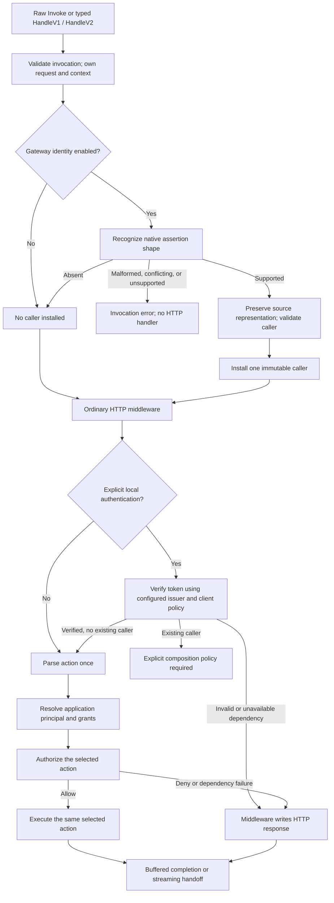

# 0012: Shared identity, provenance, and producer composition

Status: accepted as the starting contract on 2026-09-15; claims foundation
implemented under 0014, caller/context and gateway producers pending.

This walks the dependencies needed for the first callable buffered adapter.
Decision 0013 covers the public errors used at those boundaries. Approval of the
implementation order does not approve these new API and trust decisions.

## Evidence and constraints

- `adapter.go` records WithGatewayIdentity, but does not yet produce identity.
- `decode.go` preserves raw authorizer JSON separately from SDK event types.
  Typed entry points must not marshal events to get back onto that path.
- `invocation.go` already owns cancellation, the original body, multipart
  cleanup, and panic propagation. Identity must fit inside that lifetime.
- Decision 0001 accepts anonymous by default, native gateway identity by opt-in,
  and explicitly configured local verification. It leaves producer precedence
  open. The saved Beakley review found both an invalid IAM/JWT union and an
  anonymous context value that prevented subsequent bearer verification.
- Go's context documentation recommends private keys and request-scoped values.
  Go rules favor concrete producer types and interfaces defined by consumers.
  The Go 1.27 notes make direct JSON v2 available with strict defaults; generic
  methods are available but do not, by themselves, justify a generic claims API.
- AWS documents different REST identity fields for IAM, Cognito, and custom
  authorizers. HTTP API payload 1.0 and REST share a shape; payload version does
  not identify the API product or its configured authorization type.
- The installed AWS SDK v1.55.0 has independent JWT, IAM, and Lambda authorizer
  fields in V2, with JWT claims represented as map[string]string. V1 authorizer
  data is map[string]any. These are data containers, not identity validators.
- AWS JWT authorizers validate aud preferentially to client_id when both exist;
  that does not make those fields interchangeable in an application identity.
  Scope checks also depend on route configuration. A gateway assertion does not
  universally establish that an access-token-only policy was applied.

Official sources checked through AWS public MCP and installed Go documentation:

- [REST proxy identity fields](https://docs.aws.amazon.com/apigateway/latest/developerguide/set-up-lambda-proxy-integrations.html)
- [HTTP API event formats](https://docs.aws.amazon.com/apigateway/latest/developerguide/http-api-develop-integrations-lambda.html)
- [JWT authorizer validation](https://docs.aws.amazon.com/apigateway/latest/developerguide/http-api-jwt-authorizer.html)
- [Custom authorizer output](https://docs.aws.amazon.com/apigateway/latest/developerguide/api-gateway-lambda-authorizer-output.html)
- [HTTP API custom authorizers](https://docs.aws.amazon.com/apigateway/latest/developerguide/http-api-lambda-authorizer.html)
- [Cognito claim meanings](https://docs.aws.amazon.com/verifiedpermissions/latest/userguide/cognito-map-token-to-schema.html)
- [M2M authorization](https://aws.amazon.com/blogs/security/how-to-monitor-optimize-and-secure-amazon-cognito-machine-to-machine-authorization/)
- [STS session identity](https://docs.aws.amazon.com/STS/latest/APIReference/API_AssumedRoleUser.html)
- [SDK event types at v1.55.0](https://pkg.go.dev/github.com/aws/aws-lambda-go@v1.55.0/events)
- [Context values](https://pkg.go.dev/context#WithValue)
- [Go 1.27 release notes](https://go.dev/doc/go1.27)

## Design graph



The action-selector order relative to authentication is application policy.
The invariant is that authorization and execution use the same selection.
Identity is independent of the selected action and carries no dispatcher state.

## I1. Concrete caller, with an enforced union

**Question:** interface, exported struct with optional arms, or an opaque value?

**Recommend:** a small concrete `identity.Caller` with private representation,
anonymous zero value, and mutually exclusive JWT/IAM views. Construction returns
an error for invalid inputs; users cannot set both arms. Read-only value methods
can share immutable backing data. There is no AWS dependency in identity.

Proposed core surface (declarations illustrate the contract, not runnable code):

```go
type Caller struct { /* private immutable representation */ }
func (c Caller) Kind() Kind
func (c Caller) Source() Source
func (c Caller) JWT() (JWT, bool)
func (c Caller) IAM() (IAM, bool)

func FromContext(ctx context.Context) Caller
func WithCaller(ctx context.Context, caller Caller) (context.Context, error)
```

Kind distinguishes anonymous, JWT, and IAM. Source distinguishes no identity,
gateway assertion, locally verified token, and explicitly mapped custom
assertion. JWT/IAM views have private fields and read-only accessors. Avoid a
second Authenticated boolean that can disagree with the union. Do not make a
public equality/hash contract for the entire caller or infer equivalence from
matching subjects. Consumers may define small interfaces where actually needed.

**Reasoning:** this prevents the reproduced dual-arm authorization bug at the
construction boundary. An implementable Caller interface or public pointer arms
would require every authorization rule to re-check the union.

## I2. Construction is validation, not verification

**Question:** what security guarantee does a constructed caller make?

**Recommend:** constructors validate representation and own their inputs. The
producer is responsible for authentication and source attribution. Constructors
do not parse bearer headers, verify signatures, fetch keys, or decide permissions.
Source is useful provenance recorded by trusted application code, not a proof
that hostile code in the same process cannot forge.

Identity is a snapshot established for a request, with no clock or network work
in its accessors. Expiry checks belong to the authenticating producer's admission
policy. Long-running streams do not silently refresh credentials or acquire new
permissions; any later reauthorization is explicit application policy.

Recommended producer shape:

```go
func NewJWT(claims Claims, source Source, opts ...JWTOption) (Caller, error)
func NewIAM(principalARN string, source Source, opts ...IAMOption) (Caller, error)
```

JWT options supply information that is separate from the claim object, notably
the gateway's dedicated scopes collection. They must not override issuer,
subject, or permissions already represented by conflicting source data. Reject
duplicate assignments for identity construction rather than using last-wins
to conceal contradictory assertions. No mutating caller builders or setters.

JWT source may be gateway, verified token, or explicit custom mapping. Initially
IAM source may be gateway or explicit custom mapping; there is no local SigV4
verifier. Reject unknown sources and impossible source/kind combinations.

**Alternative:** an unforgeable-looking internal constructor would make external
verifiers and fixtures awkward while failing to secure against application code
that already controls the authorization pipeline.

## I3. JWT principal and permission semantics

**Recommend these distinct fields/accessors:**

| Fact | Recommendation and reason |
| --- | --- |
| Issuer | Required nonempty exact string; do not lowercase or normalize. Verification decides the trusted issuer policy. |
| Subject | Optional nonempty value; when present, identify it together with issuer. Never use bare sub as a global identity key. |
| Client ID | Separate optional nonempty value. Do not substitute audience or silently treat a missing subject as a user. |
| Minimum identifying material | Require subject or client ID. A client-only caller is representable, but application policy must decide whether it is an acceptable machine principal. Missing sub alone does not prove a client-credentials flow. |
| Audience | Preserve string versus actual array at the claim layer; normalized audience collection only when its representation is understood. Do not copy it into client ID. |
| Token use | Preserve if supplied, with no invented default. Cognito access-token-only restrictions belong to authn's verifier policy. |
| Scopes | Separate from groups and grants. Prefer the explicit gateway scopes field when present; compare any independently interpretable claim scopes and reject disagreement rather than unioning them. |
| Cognito groups | Preserve the Cognito-specific name/meaning. Do not reinterpret arbitrary groups/roles claims as Cognito groups. |
| Application grants | Produced by application principal resolution in authz, not appended to the authenticated token's claims. |

Use comma-ok accessors for optional facts and collections. A known empty
collection differs from unavailable data. Set-valued authorization checks are
case-sensitive and exact; normalization may deduplicate identical elements but
must not change their spelling or apply wildcard semantics.

**Issue:** gateway string representations of aud, scp, or cognito:groups do not
provide a general reversible encoding for their original JSON types. Recommend
no bracket stripping, comma splitting, or reparsing a string as embedded JSON.
An actual JSON array can supply a list; a flattened ambiguous value cannot.
OAuth scope strings are a specific documented space-delimited representation,
not a precedent for splitting unrelated claims.

If a recognized claim has an invalid actual type, reject the producer's input.
If the source has flattened away its type, retain that representation and mark
the normalized collection unavailable. A rule requiring unavailable information
must not authorize. A custom claim schema or local verification can resolve the
missing fidelity later; do not fill the gap with an unverified header JWT.

## I4. Owned claims with explicit representation

**Question:** can a map[string]any or map[string]string be the shared claims API?

**Recommend:** an immutable `Claims`/`Claim` view, with separate construction from
raw JSON, gateway string maps, and already decoded SDK V1 values. The names and
complete accessor inventory are a follow-on API detail to review before that
part is implemented; the recommended semantics are concrete:

- Raw claim JSON is validated with direct JSON v2. Preserve exact numeric text,
  arrays, objects, null, and booleans. This is fidelity to the received claim
  object, not a claim that API Gateway preserved the original JWT bytes.
- Gateway string values remain marked as gateway text. A value resembling JSON
  is still text. Scalar claim interpretation must use its declared schema.
- Already decoded SDK values are copied directly without marshaling. Preserve
  the available shape. An upstream float64 must not be presented as the original
  exact JSON number, even when its current value happens to be integral.
- Validate UTF-8 on directly supplied strings as well as JSON input. Do not
  coerce incorrectly typed standard claims or silently rewrite identifiers.
- Expose presence, representation, and checked scalar/list access, not unchecked
  assertions. Wrong-type reads must be distinguishable from missing values.
- Copy input maps, slices, and JSON bytes; returned containers/bytes must not
  provide mutation access. Immutable views may share private owned backing data.
- Retain unknown claims without promoting them to permissions. Do not store the
  bearer token or complete Authorization header in identity.
- Do not expose a generic `Claim[T]` convenience in the first API. It would hide
  conversion and fidelity policy before those conversions are well established.
- No implicit JSON export of an entire caller. Default diagnostic formatting
  should describe kind/source without dumping claims or identifiers. Explicit
  application logging remains application-owned.

**Remaining resource issue:** cloning a typed V1 map can encounter huge input,
cycles, or arbitrary Go objects. Recommend a closed set of supported JSON-like
types, cycle/depth checks, and a measured claim resource budget before exposing
those constructors. Reject unsupported values without invoking custom marshal
methods. Numeric budget defaults need a separate measured proposal; no AWS
claim-size quota is inferred here. This can be investigated independently while
the caller/context/error core is implemented after approval.

## I5. IAM facts remain exact facts

**Recommend:** retain the exact principal ARN, parsed partition/account/service
and principal form, and optional gateway principal identifiers. Validate the
principal form rather than accepting any syntactically valid resource ARN.
Cross-check an independently supplied caller account ID against the ARN.

Do not use requestContext.accountId as the caller account: it is API-owner
metadata. Do not use access-key ID, source IP, API key, mTLS metadata, or a Cognito
identity-pool ID alone as proof of IAM identity. Do not retain access-key/API-key
values in the shared caller.

Keep an STS session ARN as an STS session ARN. Do not manufacture an IAM role ARN
or remove a session name to pretend to recover a stable role identity. Support
for the documented caller forms and their ARN grammar needs explicit fixtures
in the producer implementation; unsupported forms fail rather than falling back
to anonymous. ARN authorization matching and role/session resolution remain
authz policies, not IAM policy evaluation in identity.

**Reasoning:** STS documents both the ARN and ID as including session identity;
losing that information changes what an application is authorizing.

## I6. Context installation and invocation isolation

**Recommend:** FromContext returns the anonymous zero value when absent.
WithCaller uses a private context key, returns a derived context, and never
mutates shared state. Supplying anonymous to an empty context is a no-op. It
cannot clear an existing nonanonymous caller. Installing another nonanonymous
caller, even one with apparently matching fields, returns identity.ErrConflict.

Expose identity.ErrInvalidCaller for invalid construction and identity.ErrConflict
for producer collisions. Do not add a HasIdentity API whose presence test can
become an authentication shortcut. Nil context is invalid; installation returns
an error and FromContext requires a nonnil context like ordinary context use.

**New invocation boundary recommendation:** reject a parent context already
carrying a nonanonymous identity, before running the HTTP handler, on raw and
typed entry points in either gateway mode. Preserve unrelated context values.
This makes accidental reuse of a previous request's caller visible. Native HTTP
middleware is unaffected because it does not pass through a Lambda entry point.

**Alternatives:** inheriting the caller can authorize a different invocation;
silently masking it conceals a composition mistake and needs a clearing API.
Explicit support for a preauthenticated invocation could be added later if a
real consumer requires it. Do not infer that authorization from an arbitrary
context supplied to an entry point today.

## I7. Gateway recognition: absent, invalid, and unsupported differ

**Recommend this behavior when WithGatewayIdentity(true):**

| Input | Outcome |
| --- | --- |
| Absent/null authorizer, null placeholder claims/scopes, no IAM assertion | Anonymous; handler runs |
| One supported native JWT or IAM assertion | Normalize, validate, install caller |
| Present recognized assertion missing required identity data or wrong-shaped fields | Invocation error; handler does not run |
| Simultaneous IAM/JWT or native/custom assertion candidates | Conflict error; never choose by field order |
| Nonempty custom authorizer context without a configured mapper | Unsupported identity error; never treat principalId alone as native IAM/JWT |
| No authenticated caller but sourceIp/userAgent/API-key metadata exists | Anonymous; those fields are not an authentication producer |

With gateway identity disabled, authorizer data does not establish identity and
semantic identity validation is skipped. Raw JSON syntax is still validated by
the existing decoder. Identity opt-in is not a RequireAuthenticated option;
applications protect routes through authn/authz middleware.

**Qualification:** V2 has explicit JWT/IAM/Lambda containers, but V1 has no
reliable universal authorizer-type discriminator. Follow documented native
claims/identity shapes conservatively; principalId/custom indicators take a V1
event out of native inference. Do not claim this proves deployment settings.
An event producer can forge any event shape; trust in gateway assertions already
requires the intended restricted integration as accepted in decision 0001.

Unknown extension fields alongside a recognized native assertion are not, by
themselves, another producer. Retain/ignore them according to the metadata
contract without promoting them to permissions. A nonempty authorizer object
with no recognized native producer remains unsupported. This permits documented
AWS field additions without making arbitrary custom contexts authoritative.

The HTTP API 1.0 documentation supplies a null-authorizer example, not a complete
matrix of JWT/IAM claim encodings. Carry this as a fixture/documentation coverage
gap, especially for flattened collections. Do not invent a V1 array encoding or
silently restrict transport support to solve it. Add independently sourced
fixtures for each supported producer shape before claiming that combination.

## I8. Local authentication and custom producers

**Recommend:** the default local bearer middleware verifies only when no caller
has been established. If already authenticated input reaches it, fail as an
explicit composition conflict; do not skip based on context presence, replace
the caller, or merge permissions. Applications initially choose one producer per
route through ordinary middleware composition.

This is deliberately conservative: a gateway-authenticated route normally still
contains its Authorization header. The adapter must not mistake that header for
a second authentication producer. A collision happens when another configured
producer runs, not merely because credentials are present in a header.

Future gateway fallback or re-verification can be explicit policies with their
own comparison rules. A fallback policy would invoke the local verifier only
for anonymous input. Re-verification must validate its own issuer/client policy
and cannot equate identities by sub/client_id alone. Defer their option names
and credential-conflict behavior until the authn middleware design.

Custom-authorizer mapping is also deferred. When added, it should return a
validated Caller through a context-aware function, with no silent fallback and
no automatic extra-claim merge. It may eventually need a distinct custom
principal kind; do not force an arbitrary principalId into IAM or JWT now.

## Implementation graph and acceptance

1. Approve/revise caller invariants, provenance, context, and error contracts.
2. Implement caller/context/error core and test construction/ownership/conflicts.
3. Review the precise claims accessors, budget measurements, and producer fixture
   matrix. Implement shared claim normalization and minimum native producers.
4. Wire raw and typed buffered invocation using the same producers and errors.
5. Prove registration through the real SDK wrapper; add runnable examples.
6. Design local Cognito verification/JWKS behavior and authz against this core.
7. Reuse the same preparation boundary in the separate streaming entry points.

Do not publish incomplete constructors or placeholder invocation methods to
represent these intermediate steps. The claim contract must be ready before
publishing constructors that depend on it.

Acceptance includes anonymous-to-local-verifier composition, dual-source
rejection, raw/typed equivalence where information survives, explicit loss of
fidelity, copied input/output containers, preserved issuer/client distinctions,
no action/grant mutation of authenticated claims, and no cross-invocation caller
inheritance. No live AWS invocation is needed for this design review.

## Resolution

The user agreed with all recommendations as a starting point on 2026-09-15.
This accepts I1-I8 and the implementation order. The explicitly deferred claim
accessor inventory, claim resource limits, producer fixture coverage, and later
authn/custom-mapper policies still require their recorded follow-up review.
The claims constructors, immutable views and resource/error foundation are now
implemented under accepted decision 0014. Caller/context construction and native
gateway producers remain pending. Decision 0015 presents the supported IAM caller
forms left open by I5 for review before the complete caller union is published.

Accepted follow-up 0016 adds an online STS-verified IAM proof producer alongside
the gateway/custom producers described in I2. Its provenance representation will
be settled in the protocol/API review. For I8, one explicitly configured selector
may choose IAM proof or OAuth verification per request on the same route. It
still installs only one caller and never retries another credential mechanism
after authentication failure or merges identities.
