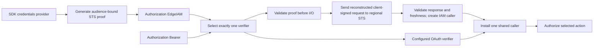

# 0017: IAM proof protocol and Go helper

Status: accepted on 2026-09-16. The user approved P1-P5 and the four caller forms
in decision 0015. The production iamproof generator and verifier are implemented
after the shared caller and buffered-adapter foundations, with local validation.
Common HTTP authentication selection is implemented under decision 0019;
live AWS interoperability remains pending.

## Evidence

AWS documentation was checked through public AWS MCP. SDK public API definitions
were checked with the Go documentation skill at the versions below. At initial
proposal time, identity implemented claims; caller construction, native gateway
production and the IAM proof producer have since been implemented.

- [GetCallerIdentity](https://docs.aws.amazon.com/STS/latest/APIReference/API_GetCallerIdentity.html)
  returns Account, Arn and UserId for the signing credentials, without requiring
  a granted permission. Its documented response is XML. It does not grant
  permission to execute an application action.
- [Regional STS endpoints](https://docs.aws.amazon.com/sdkref/latest/guide/feature-sts-regionalized-endpoints.html)
  are AWS's recommendation. Use an explicit region, not implicit global routing.
- [SDK v4 presigning](https://pkg.go.dev/github.com/aws/aws-sdk-go-v2@v1.47.0/aws/signer/v4#Signer.PresignHTTP)
  returns the signed URL and required signed headers. It does not automatically
  set expiration; its documentation warns that not every service uses
  X-Amz-Expires. Do not infer a hard STS lifetime from that parameter.
- [AWS IAM Authenticator](https://github.com/kubernetes-sigs/aws-iam-authenticator/blob/master/pkg/token/token.go)
  provides implementation evidence for a signed destination header and explicit
  date checks. Its code notes that STS ignores X-Amz-Expires. That is reference
  implementation evidence, not an AWS-documented service guarantee.
- [HTTP API quotas](https://docs.aws.amazon.com/apigateway/latest/developerguide/http-api-quotas.html)
  cap combined request-line and header-value size at 10,240 bytes. Proof transport
  must share that space with the action header and all other request metadata.
- [STS credentials](https://docs.aws.amazon.com/STS/latest/APIReference/API_Credentials.html)
  do not have a fixed documented session-token size. A library transport limit
  must not be described as AWS's maximum credential size.
- [STS quotas](https://docs.aws.amazon.com/IAM/latest/UserGuide/reference_iam-quotas.html)
  document a default shared 600 requests/second per account per Region for
  credential-based STS requests, including GetCallerIdentity.
- [STS common errors](https://docs.aws.amazon.com/STS/latest/APIReference/CommonErrors.html)
  include expired credentials/requests and unrecognized clients, but also a
  throttling error with HTTP status 400. HTTP status alone cannot distinguish
  invalid credentials from dependency failure.
- [Go 1.27](https://go.dev/doc/go1.27) and the existing module contract support
  using encoding/json/v2 directly. XML responses use encoding/xml; no JSON v1
  shim is needed for the proposed protocol.

Latest stable modules resolved on 2026-09-16: AWS SDK core v1.47.0, STS v1.51.0,
and config v1.33.5. Lambda Go remains v1.55.0. The [standalone probe](../probes/iamproof/README.md)
uses the first two. They were rechecked as latest stable when added to production
go.mod on 2026-09-16. Explicit module versions provide repeatable builds, not a
permanent freeze on an old SDK.

## P1. Public package and credential ownership

Recommend one focused `iamproof` companion package for the exported client helper
and server verifier. Keep Caller in AWS-free `identity`; keep HTTP credential
selection in `authn`. This concrete client use justifies an additional package
under the plan's package-boundary rule. Avoid importing IAM SDK implementation
packages from shared selector code: accept a consumer-defined verifier function
there, so a JWT-only application does not link the IAM implementation.

Proposed surface, with opaque concrete Generator, Verifier and Token types:

```go
func NewGenerator(region, audience string, credentials aws.CredentialsProvider) (*Generator, error)
func (g *Generator) Generate(ctx context.Context) (Token, error)
func (t Token) Value() string
func (t Token) ExpiresAt() time.Time
func NewVerifier(region, audience string, opts ...VerifierOption) (*Verifier, error)
func WithTransport(transport http.RoundTripper) VerifierOption
func WithTimeout(timeout time.Duration) VerifierOption
func (v *Verifier) Verify(ctx context.Context, token string) (identity.Caller, error)
```

Value returns the versioned credential; the HTTP client sends `EdgeIAM ` followed
by that value. ExpiresAt is the earlier of proof expiry and credential expiry
when known, an upper bound rather than a guarantee of future AWS acceptance.
Token's ordinary string/debug formatting is redacted; extracting Value is
explicit. The zero Token is unusable and exposes empty value/zero expiry.

Use the SDK's CredentialsProvider directly. Applications load/cache/refresh
credentials using their existing SDK configuration; the helper does not invent
another provider hierarchy or call AssumeRole on their behalf. Generate retrieves
credentials each time, so the provider can refresh. The provider may perform I/O;
local presigning itself makes no STS request. Require complete, unexpired
credentials; preserve temporary session tokens. Ignore provider AccountID as
authentication evidence. Configuration and objects are immutable after creation;
concurrent use requires a concurrency-safe provider/transport.

Use SDK v4.Signer for signing and STS's public endpoint resolver for endpoint
metadata. STS PresignGetCallerIdentity is an alternative, but inserting the
application header and fixing signing time/expiry requires middleware hooks.
The small, fixed Query request makes the lower-level official signer clearer.
Never implement SigV4 cryptography ourselves. Verifier accepts no credentials
provider and never signs the forwarded request with the Lambda role.

Alternative: put everything in authn or reexport it from edge. That couples
client generation to HTTP middleware or broadens the adapter's root API.

## P2. Wire format and one credential selection

Recommend `Authorization: EdgeIAM v1.<unpadded-base64url(JSON)>`. Bearer continues
to select the configured OAuth verifier. Scheme matching is case insensitive;
the version and encoded token are strict. Repeated, combined, empty, unknown or
malformed credentials fail. Never try another verifier after a rejection.
Do not accept a second proof in a cookie, query parameter or alternate header.

The JSON object has exactly these fields:

```json
{"audience":"orders.production","credential":"ACCESSKEY/20260916/eu-west-2/sts/aws4_request","date":"20260916T120000Z","signature":"64-lowercase-hex-digits","sessionToken":"optional-temporary-credential-token"}
```

The signature placeholder above illustrates a field, not a valid test vector.
Require all fields except sessionToken, reject nulls/unknown/duplicate fields,
invalid UTF-8 and trailing data, and require canonical unpadded base64url.
Absent sessionToken means long-lived credentials; a present empty token fails.
Use JSON v2 directly. JSON member order does not affect the AWS signature.

All remaining request components are fixed: HTTPS GET, regional STS host, `/`,
no body, Action=GetCallerIdentity, Version=2011-06-15,
X-Amz-Algorithm=AWS4-HMAC-SHA256, X-Amz-Expires=60, and
X-Amz-SignedHeaders=host;x-edge-iam-audience. The verifier constructs this request
from trusted configuration plus the validated variable fields. It accepts no
client-supplied URL, method, action, endpoint override or arbitrary headers.

Credential scope must match the date, configured region, service sts and terminal
aws4_request. Validate syntax without claiming that an access key exists. Only
STS can authenticate it. Reject inputs before I/O where possible.

Alternative: base64url of a complete presigned URL, as used by established
authenticator protocols. It is easier to inspect but admits more parser states
and expands escaped session tokens. The local probe reconstructs the SDK's signed
request across twelve cases and confirms the audience changes the signature.
A synthetic 4 KiB escape-heavy session token produces a 5,767-byte compact proof
versus 14,175 bytes for an encoded URL. This is a stress measurement, not a claim
about typical AWS tokens. The new wire format is our protocol, not EKS-compatible.

## P3. Destination binding, lifetime and replay

Require an explicit, matching application/environment audience at both ends.
Use 1-256 visible ASCII bytes without spaces, case sensitive and unnormalized;
deployments should use unique values such as orders.production. Compare the
envelope audience to server configuration before I/O; send the configured value
in X-Edge-IAM-Audience. Its inclusion in SignedHeaders makes changing it invalidate
the signature. A matching plaintext audience by itself proves nothing.

Recommend a fixed 60-second proof lifetime in protocol v1, with at most 30 seconds
of future clock tolerance and no expired-token grace. Sign whole UTC seconds;
server requires issuedAt <= now+30s and now < issuedAt+60s. Recheck after STS returns
before creating a caller. Future tolerance means the maximum possible local
acceptance interval is 90 seconds, not a promised 60 seconds of wall time under
skew. STS may reject more strictly. Credential expiration may shorten validity.

This is a bearer authentication proof: it can be reused for the same audience
while fresh. It does not bind the API method, action header or request body and
is not a single-use challenge. Require HTTPS to the application and STS. Client
code may reuse a generated proof until its expiry; every server verification
still calls STS. Do not log proof values, session tokens or signed URLs.

Alternative: request-body binding or a nonce/challenge store. Either changes the
client flow and adds a separate protocol/state requirement. Recommend the short,
audience-bound bearer contract first, with this limitation explicit rather than
claiming general replay prevention. An STS success is not application authorization.

## P4. Endpoints, limits and online verification

Require one explicit regional endpoint per generator/verifier, resolved with
the stable STS SDK metadata. Validate configured region syntax; resolution is not
a promise that an account can use that region. Initial support uses standard
regional HTTPS endpoints; no global, FIPS, dual-stack or arbitrary URL switches.
Do not silently fall back to global STS or another region/partition. The probe
checks commercial, GovCloud and China resolution, not live AWS availability.

Proposed engineering limits, not claimed AWS limits:

| Boundary | Initial policy | Reason |
| --- | --- | --- |
| Encoded credential, including v1. prefix | 8 KiB, fixed | Bound decoding and leave some of the HTTP API header budget for other fields |
| STS response body | 64 KiB, fixed | Bound success/error XML parsing; the documented identity is small |
| Verification network deadline | 5 seconds by default; positive override | Bound STS work; caller's earlier context deadline still wins |
| Automatic retries / verification cache | None | Predictable per-request work and fresh AWS verification |

Check the encoded limit before allocation and on generation. Return an explicit
size error from the helper; never truncate session credentials. The 8 KiB policy
does not guarantee that a request with other headers fits its gateway, nor that
every valid STS session fits this transport. The probe's 6 KiB synthetic session
already exceeds it. Endpoint policies/proxies may impose additional URL limits.

Use an owned HTTP client with redirects disabled, no cookie jar, explicit context
deadline and bounded reads. Close every response body. WithTransport supplies
trusted deployment infrastructure, including custom TLS/proxy settings; it is
not an input taken from a request. A transport that ignores cancellation or
performs retries internally is outside guarantees edge can enforce.

Read the documented XML response using encoding/xml. Require one expected
response/result, exactly one nonempty Account/Arn/UserId, expected namespaces,
no duplicate identity fields and no second document. Bounded nonidentity metadata
can be ignored for forward compatibility. Cross-check account and partition
against the returned ARN and configured endpoint partition. Reject contradictory
or unsupported identities. Do not assume that setting Accept to JSON is a
documented GetCallerIdentity response contract.

No server-side cache initially means an STS round trip for every IAM request.
The shared 600 RPS default makes this unsuitable for unbounded throughput without
capacity planning. Application throttling/admission control remains necessary.
Caching would extend acceptance after credential invalidation and requires its
own TTL, key, eviction and overload policy; review it separately if needed.

## P5. Caller provenance and errors

Recommend accepting the four initial forms from decision 0015: IAM root/user and
STS assumed-role/federated-user sessions. Preserve the full ARN/session and STS
UserId, cross-check Account, and add SourceVerifiedIAMProof for this producer.
Do not convert a session ARN into a role ARN or infer grants from it. Provenance
records what trusted producer code did; manually constructing the same enum does
not authenticate anything. Root representation does not permit root access.

Verify returns a caller only after successful STS verification, response checks,
and the final freshness check; every failure returns an anonymous zero caller.
It does not install context. The shared authn selector installs one caller and
honors the existing prohibition on replacing/merging an existing caller.

Recommend inspectable package errors ErrInvalidProof, ErrUnavailable,
ErrCredentialsUnavailable and ErrProofTooLarge. Constructor configuration errors
are programmer/deployment errors; use a separate ErrInvalidConfiguration.
All error messages/chains are sanitized; do not wrap provider errors, raw XML,
HTTP url.Error values or SDK signing diagnostics containing credential material.
Preserve caller cancellation/deadline via errors.Is without exposing unsafe causes.

| Condition | Classification and protected HTTP behavior |
| --- | --- |
| Missing/malformed/expired/oversized incoming proof, wrong binding/scope | Invalid credentials; 401 |
| Documented STS invalid-key/token/signature rejection | Invalid credentials; 401 |
| DNS/TLS/network failure, internal timeout, throttle, 5xx, redirect, unexpected status/response | Dependency unavailable; 503 |
| Successful STS response with missing/contradictory/unsupported identity | Dependency protocol failure; 503 |
| Authenticated caller denied the selected application action | Authorization denial; 403 |
| Client provider retrieval/signing failure or expired/incomplete credentials | Helper error; no proof returned |

Do not classify every AWS 4xx as invalid credentials. Start the invalid-credential
allowlist with documented ExpiredTokenException, IncompleteSignature,
MissingAuthenticationToken, RequestExpired and UnrecognizedClientException;
include InvalidClientTokenId as documented for GetCallerIdentity in
[AWS's EKS troubleshooting reference](https://docs.aws.amazon.com/eks/latest/userguide/troubleshooting.html).
Verify any further service-specific aliases against official sources and fixtures
before adding them. Unrecognized errors fail closed as unavailable; throttling
remains unavailable even with HTTP 400. Caller cancellation returns the context error;
writing a response after disconnection follows the HTTP middleware lifecycle.
WWW-Authenticate challenges and the shared selector API are specified by
decision 0019, separately from the proof verifier. These are HTTP failures, not Lambda invocation
errors under decision 0013.

## Design graph and implementation sequence



1. Review P1-P5, including the still-pending caller forms in 0015.
2. Complete the shared caller/context foundation and native gateway fixtures,
   then the callable buffered adapter in the already accepted order.
3. Implement helper and verifier together with round-trip fixtures, current stable
   SDK dependencies and an explicit versioned protocol specification.
4. Test malformed/duplicate/oversized inputs, tampering, wrong region/audience,
   clock boundaries, credential expiry, endpoint/redirect constraints, XML
   contradictions, cancellation, dependency classification and redacted errors.
   Use synthetic credentials, fake transports and local servers, not live AWS.
5. Review/wire the common authn selector and complete IAM/OAuth client/server
   examples plus authz examples. Keep action extraction separate from proof
   parsing and require authorization for each selected action.

The original probe passes local SDK reconstruction and audience-change checks
with race detection. The production package now implements the security
validation above. Neither establishes real STS acceptance, deploys API Gateway
or settles HTTP middleware APIs. A separately authorized integration check can
later validate deployed interoperability.

## Resolution

The user approved this proposal and decision 0015 on 2026-09-16 and authorized
implementation in the recorded order. Complete the shared caller/context and
buffered adapter foundation before the IAM helper/verifier and authn middleware.
The isolated probe remains the only implemented IAM-proof artifact at approval.

## Implementation evidence, 2026-09-16

The production `iamproof` package implements P1-P5 with direct JSON v2, the SDK
signer, bounded XML verification, caller construction, sanitized errors and
runnable local client/configuration examples. The [consumer guide](../iamproof.md)
records operational constraints and the still-pending common HTTP selector.

The SDK V2 endpoint result does not expose a partition ID. The implementation
uses the public legacy STS resolver for that metadata and requires agreement
with V2 on endpoint and signing region. This preserves the accepted SDK-metadata
boundary without private imports or a copied partition table. SDK disagreement
fails construction. Fixtures cover all eight partitions present in this release;
they do not assert service availability or account eligibility.

Two additional rejection codes were checked through AWS MCP before inclusion:
[SignatureDoesNotMatch for GetCallerIdentity](https://docs.aws.amazon.com/eks/latest/userguide/security-iam-troubleshoot.html)
and [ExpiredToken for expired temporary credentials](https://repost.aws/knowledge-center/iam-credentials-token).
Synthetic error fixtures exercise both. Other unrecognized errors remain
unavailable; no status-only invalid-credential classification was introduced.

Local validation covers official-signer request reconstruction, all four caller
forms, opaque session tokens, wrong audience/scope, tampering, canonical encoding,
malformed/duplicate/null JSON, credential expiry, future/expiry boundaries,
expiry during verification, namespaces/duplicate or contradictory XML identity,
bounded reads and body closure, local TLS/redirect/cookie behavior, caller and
internal deadlines, sanitized failures, provider retrieval and concurrent use.
Initial ten-second fuzz runs completed 464,009 proof-parser and 172,753 XML-parser
executions without failures. These are synthetic/local results, not live STS
acceptance evidence. No automatic retry, result cache or HTTP selector was added.
Full module race tests, vet, formatting checks and Linux arm64/amd64 builds pass
on Go 1.27.1. The existing CI workflow includes this package automatically; no
GitHub CI run has been performed for these changes yet.
