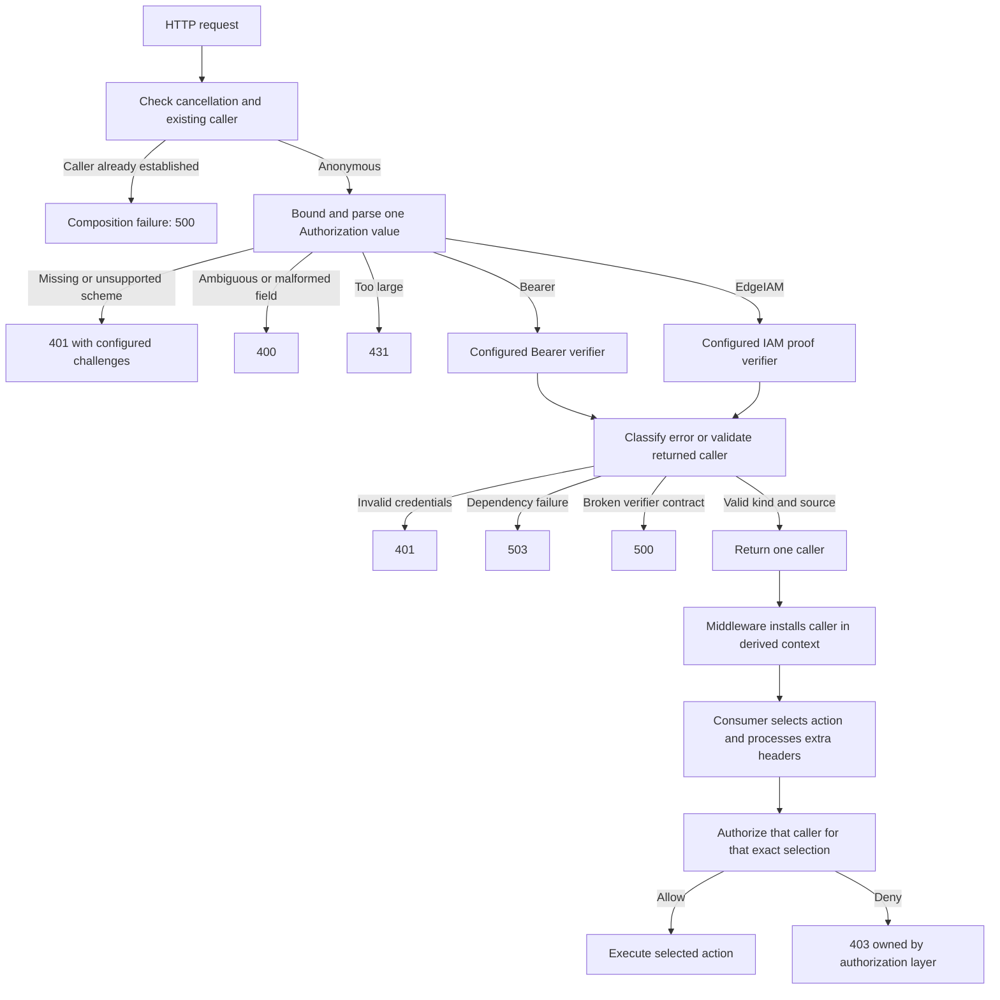

# 0019: HTTP authentication selection and challenges

Status: proposed on 2026-09-16; awaiting user review. The user authorized this
design walk after implementation of iamproof. No authn API or middleware is
implemented by this record. Recommendations A1-A6 are reviewable together.

## Evidence and existing contracts

- Decisions 0012/0016/0017 already require one explicit producer, no identity
  merging, scheme-based selection, and no fallback after verification fails.
  Gateway identity remains disabled by default.
- `identity/context.go` rejects every replacement of an established caller.
  `iamproof.Verifier.Verify` returns a caller without installing it, preserves
  caller cancellation and distinguishes invalid proof from unavailable STS.
- `action.go` already handles case aliases and duplicate/comma-bearing values.
  `http.Header.Get`/`Values` alone cannot inspect noncanonical map aliases; the
  installed Go docs explicitly require direct map access for those keys.
- [AWS payload-format documentation](https://docs.aws.amazon.com/apigateway/latest/developerguide/http-api-develop-integrations-lambda.html),
  read through AWS public MCP, says HTTP API payload 2.0 combines duplicate
  headers with commas. Payload 1.0 has multivalue headers. This is API Gateway's
  event format, not a version of our module.
- [RFC 9110 sections 11.1, 11.3 and 11.6](https://www.rfc-editor.org/rfc/rfc9110.html#section-11)
  define case-insensitive schemes, mandatory applicable challenges for 401,
  and the WWW-Authenticate list grammar. Decision 0010 and existing response
  tests already support separate V1 challenges and correct V2 combination.
- [RFC 6750 sections 2.1 and 3](https://www.rfc-editor.org/rfc/rfc6750.html#section-3)
  define Bearer credential syntax and distinguish malformed requests (400),
  invalid tokens (401), and inadequate scope (403). Missing credentials and
  unsupported authentication methods receive challenges without error details.
  A realm parameter provides a concrete challenge without disclosing policy.
- [AWS HTTP API CORS documentation](https://docs.aws.amazon.com/apigateway/latest/developerguide/http-api-cors.html),
  read through AWS public MCP, describes automatic preflight responses when CORS
  is configured and separate OPTIONS routing considerations. CORS is deployment
  or outer HTTP middleware policy, not an authentication bypass to infer here.
- Go rules favor a small config struct when consumers set a few explicit
  dependencies, concrete immutable implementations, and consumer-owned
  interfaces. Go 1.27's request-header value-count limit does not replace these
  checks for Lambda-created or manually constructed http.Header values.

## Design graph



The action order is illustrative, not enforced by authn. A consumer may perform
cheap action parsing earlier, but must authorize and execute the same selection.

## A1. Public boundary and configuration

Recommend an opaque immutable `authn.Authenticator`, explicit verifier functions
and one small configuration value. Proposed signatures:

```go
type VerifyFunc func(context.Context, string) (identity.Caller, error)

type Config struct {
    Bearer                VerifyFunc
    IAMProof              VerifyFunc
    Realm                 string
    MaxAuthorizationBytes int
}

func New(cfg Config) (*Authenticator, error)
func (a *Authenticator) Authenticate(ctx context.Context, headers http.Header) (identity.Caller, error)
func (a *Authenticator) Handler(next http.Handler) (http.Handler, error)

type Error struct { /* private sanitized representation */ }
func (e *Error) Error() string
func (e *Error) Unwrap() error
func (e *Error) StatusCode() int
func (e *Error) Challenges() []string
```

At least one verifier is required; nil disables that scheme. New validates and
copies configuration, performs no I/O and does not call verifiers. Empty Realm
defaults to `edge`; explicit realms contain 1-256 printable ASCII bytes, with
quotes/backslashes correctly escaped in challenges. Realm is a display/protection
label, not the IAM proof audience or a JWT issuer restriction.

Authenticate reads headers without modifying them, calls at most one verifier,
and returns a caller without installing context or writing a response. Every
failure returns an anonymous zero caller. Callers must not mutate the header map
concurrently. Handler validates its nonnil next handler, including typed nils,
and provides required-authentication middleware using Authenticate and
identity.WithCaller. Nil/zero Authenticators are configuration errors.

Authenticator is safe for concurrent use when its configured functions are.
Consumers may define a narrow interface with Authenticate for their dispatcher;
there is no need for a provider-owned interface or another header container.
The lower-level method is the customization boundary for application error
envelopes; Challenges returns a copy. No global registry or callback that must
both write a response and correctly stop the handler chain.

Alternative: variadic verifier-registration options or one generic scheme map.
The struct makes the two supported mechanisms visible, avoids repeated
registration semantics, and does not imply an extensible authentication plugin
framework. The root edge package keeps its existing options API.

## A2. Strict header selection and a separate field-size limit

Recommend accepting credentials only from Authorization. Inspect all ASCII
case-equivalent keys, including noncanonical Go map keys. No represented values
(absent/nil/empty slices) means missing; one empty represented value is malformed.
Repeated values fail even if identical. Any comma fails rather than selecting
one credential from Gateway's combined representation. Multiplicity has priority
over scheme/credential interpretation; size exhaustion may fail first.

Trim outer SP/HTAB, recognize schemes with ASCII case folding, require one or
more literal spaces between scheme and credential, and preserve credential case
and bytes. Internal tabs/whitespace and control/non-ASCII header bytes fail.
Configured schemes require a nonempty token68-shaped credential (ASCII letters,
digits, `-._~+/`, with `=` permitted only at the end); invalid header grammar is
400. Do not assume Bearer is a JWT or decode claims to select a verifier.
EdgeIAM receives its versioned proof unchanged; its verifier owns stricter
JSON/base64/version checks, whose rejection is 401. Likewise, a grammar-valid
Bearer string containing invalid JWT contents reaches the selected verifier and
can yield 401. A structurally valid unsupported or disabled
scheme is a 401, with no verifier call. Malformed generic scheme framing is 400.

Only header credentials participate in authentication. Do not read request
bodies, cookies or query strings to discover another credential, and never
fall back to them. Their presence does not independently establish identity;
applications must not compose a second producer that authenticates them.

Recommend MaxAuthorizationBytes default 16 KiB, configurable from 1 byte to
1 MiB; zero selects the default, negatives or larger values fail construction.
Charge represented Authorization value bytes before trimming, allocation or
verification; do not concatenate values. This is a library work bound, not an
AWS limit or a limit on all request headers. It includes scheme and whitespace.
The independent iamproof 8 KiB credential limit remains fixed: a field under
this outer bound can still contain an oversized/invalid IAM proof and yield 401.

Reasoning: the bound must fit the full approved IAM proof, scheme and framing,
while allowing larger Bearer deployments to opt in explicitly. AWS or the native
HTTP server can impose a smaller total header limit before authn is reached.
Duplicates discarded by an earlier proxy cannot be recovered or detected.

## A3. Error interoperability without SDK coupling

Recommend these inspectable authn sentinels:

`ErrInvalidConfiguration`, `ErrMissingCredentials`, `ErrMalformedCredentials`,
`ErrUnsupportedScheme`, `ErrHeaderTooLarge`, `ErrInvalidCredentials`,
`ErrUnavailable`, and `ErrVerifierContract`.

Use identity.ErrConflict for an existing caller; do not add a synonymous authn
sentinel. Runtime HTTP failures use the private-state Error wrapper above.
Its error chain contains only the sanitized category. Caller cancellation returns
ctx.Err directly, never context.Cause or a wrapped provider diagnostic.

Verifier functions must classify a definite credential rejection with
authn.ErrInvalidCredentials. Explicit ErrUnavailable or any otherwise unknown
error becomes sanitized ErrUnavailable. If an error matches both categories,
unavailable wins. A verifier context error while the request context is still
live is also unavailable: it is an internal timeout, not caller cancellation.
Any nonnil error discards a simultaneously returned caller.

Keep authn free of iamproof and AWS SDK imports. Recommend a documented explicit
adapter for the already implemented verifier:

```go
verifyIAM := func(ctx context.Context, token string) (identity.Caller, error) {
    caller, err := proofVerifier.Verify(ctx, token)
    if errors.Is(err, iamproof.ErrInvalidProof) {
        return identity.Caller{}, authn.ErrInvalidCredentials
    }
    return caller, err
}
```

The authenticator checks request cancellation independently; other returned
errors are sanitized. Passing proofVerifier.Verify directly is deliberately
insufficient for classifying its package-specific invalid-proof sentinel and
would yield 503 for that error. Documentation and examples must make the adapter
visible rather than suggest direct wiring. The first-party Bearer verifier can
return authn's categories directly when implemented.

Alternatives: importing iamproof into authn couples JWT-only binaries to STS;
making iamproof depend on HTTP authn reverses its transport-independent boundary;
a new exported errors package or reflective classification protocol adds machinery
for a mapping currently expressible in a few lines. This explicit adapter is the
main ergonomic tradeoff proposed for review.

## A4. Success invariants and producer composition

Require Bearer success to return KindJWT/SourceLocallyVerifiedToken and EdgeIAM
success to return KindIAM/SourceVerifiedIAMProof. Anonymous success, wrong kind,
gateway/custom provenance or another invalid result is ErrVerifierContract/500,
not a client credential rejection. Initial Bearer support therefore produces the
existing validated token identity; it does not add a new opaque-token principal
kind. The function must perform actual verification, not merely parse claims.

Check an already established caller before parsing credentials or running any
verifier. Return identity.ErrConflict/500 even if credentials are absent or the
apparently same identity would result. This is a deployment/composition fault,
not an instruction for the client to obtain a different token. No skip, replace,
merge or fallback option initially. This implements the previously accepted
producer policy; the HTTP classification is new here.

Recheck caller cancellation after verification and before installing/passing
control. Handler installs once in a derived context, leaves the original request
and headers intact, and preserves unrelated context values. It invokes next
exactly once only after success. Provider panics propagate under normal HTTP/
edge lifecycle policy; do not disguise application bugs as invalid credentials.

## A5. Default HTTP outcomes and challenges

Recommend the following precise HTTP mapping, refining decision 0017's broad
malformed-credential wording at the HTTP framing boundary:

| Condition | HTTP | WWW-Authenticate |
| --- | --- | --- |
| Missing header or unsupported/disabled scheme | 401 | All configured schemes, no error parameter |
| Repeated/comma-combined/empty field or malformed framing | 400 | Configured challenges; invalid_request only for unambiguously selected configured Bearer |
| Authorization field exceeds its configured bound | 431 | None |
| Selected Bearer credential rejected | 401 | Bearer with invalid_token |
| Selected IAM proof rejected, including invalid/oversized envelope | 401 | EdgeIAM challenge |
| Dependency or unknown verifier error | 503 | None |
| Existing caller or invalid success result | 500 | None |

For missing credentials with both mechanisms configured, emit two values:

```http
WWW-Authenticate: Bearer realm="edge"
WWW-Authenticate: EdgeIAM realm="edge"
```

Bearer comes first for client compatibility. Only advertise enabled mechanisms.
Use realm on every challenge. Do not invent OAuth error parameters for EdgeIAM,
echo token details, disclose issuer/account restrictions, or claim scopes are
insufficient at the authentication layer. No error_description, error_uri,
automatic Retry-After or WWW-Authenticate on dependency/internal failures.

The built-in handler writes fixed generic text using net/http conventions,
sets Cache-Control: no-store, and preserves unrelated outer middleware headers
such as CORS. It owns/replaces WWW-Authenticate on its failure responses; stale
challenges from outer middleware must not survive a 500/503/431. It performs no
logging. Error.StatusCode/Challenges support consumers writing their own JSON
response using encoding/json/v2 without exposing credentials or raw causes.

For caller cancellation/deadline, Authenticate preserves the context error.
Handler never invokes next and attempts a generic 503 without a challenge; an
already disconnected transport may reject the write. This avoids an unwritten
handler accidentally becoming an implicit 200 on an otherwise live native HTTP
connection. Edge's invocation cancellation rules still suppress a usable Lambda
response when its parent context is canceled. Do not promise wire delivery.

This is an HTTP-level refinement awaiting approval, not a change to the existing
iamproof error contract. Malformed proof/token content still yields 401; malformed
Authorization framing yields 400. Authorization owns permission denial and 403.

## A6. Routes, action dispatch and streaming

Recommend required authentication only in the initial Handler. Public routes
omit this middleware; do not add an optional-authentication mode until its
missing-versus-invalid and existing-caller semantics have a concrete consumer.
No automatic OPTIONS bypass: configure CORS/preflight at the gateway or outside
the authentication middleware. Health checks are explicit public routes.

Keep action extraction, extra headers, registry lookup and authorization in the
consumer's ordinary HTTP pipeline. Demonstrate both identity kinds reaching one
dispatcher, with each selected action independently authorized. IAM verification
does not grant all authenticated AWS accounts access. Do not bind verifier
selection to an action or pass the whole HTTP request to VerifyFunc.

Authenticate and authorize before any response commitment or streaming flush.
The resulting caller is a snapshot; this middleware does not refresh credentials
or silently reauthorize during a long stream. Applications needing continuous
authorization own a separate explicit policy.

HTTPS termination is a deployment requirement. Do not require r.TLS to be set:
API Gateway adaptation is not a live TLS server connection, and forwarded scheme
headers are not sufficient evidence to authenticate a caller.

## Implementation after approval

1. Implement pure configuration/selection/error handling with no SDK dependency.
2. Implement the low-level method and required-authentication HTTP wrapper.
3. Test header aliases, multiplicity, empty values, comma folding, whitespace,
   grammar, byte limits, disabled schemes, exactly-one calls and no fallback.
4. Test error normalization, caller-plus-error, wrong success kind/source,
   existing caller conflicts, cancellation, safe diagnostics and context isolation.
5. Test challenges/error responses on native HTTP plus raw/typed Gateway V1/V2;
   retain the actual IAM generator/verifier path with local synthetic STS fixtures.
   Inputs rejected earlier by transport validation cannot be claimed to reach
   the HTTP middleware; retain that distinction in the fixture expectations.
6. Add runnable examples for the IAM error adapter, a consumer-provided Bearer
   verifier, custom JSON failures and one action dispatcher. Label synthetic
   token verifiers in tests/examples; never present them as production JWT checks.
7. Run race/vet/Lambda builds and targeted parser fuzzing. Separately review
   Cognito/JWT/JWKS verification and authz; neither is approved implicitly here.

## Resolution

Pending user review of A1-A6, especially the public config/API, explicit IAM error
adapter, 400/401/431 distinction, and default cancellation response behavior.
