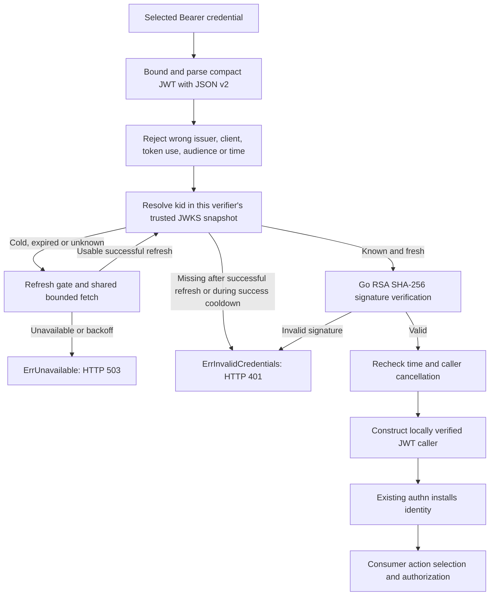

# 0020: Cognito access-token verification and JWKS ownership

Status: accepted;
verifier, key cache, examples and local validation implemented.
Reviewed against local code and official sources on 2026-09-16, with Go 1.27.1.

## Evidence and scope

The implemented `authn.VerifyFunc` already accepts a credential and returns one `identity.Caller`.
`authn.Authenticator` owns scheme selection, challenges and context installation.
`identity.ParseClaims` retains exact JSON number text;
`identity.NewJWT` validates identity shape but explicitly does not authenticate.
We can add a verifier without changing these boundaries or importing AWS SDKs into authn.
Decisions 0012, 0014, 0016 and 0019 remain in force.

AWS sources were consulted through the public AWS MCP documentation tools:

- [Verifying Cognito JWTs](https://docs.aws.amazon.com/cognito/latest/developerguide/amazon-cognito-user-pools-using-tokens-verifying-a-jwt.html): Cognito uses RS256, separate access/ID signing keys, `kid` selection and JWKS.
  Validate issuer, expiry, token use, and the appropriate client claim.
  AWS recommends caching keys, refreshing periodically and fetching on an unknown key.
- [Access-token claims](https://docs.aws.amazon.com/cognito/latest/developerguide/amazon-cognito-user-pools-using-the-access-token.html): `client_id` identifies the app client;
  `aud` is the API resource when bound.
  Scopes and groups are distinct.
  Do not impose a UUID grammar on `sub`.
- [Resource servers and resource binding](https://docs.aws.amazon.com/cognito/latest/developerguide/cognito-user-pools-define-resource-servers.html): resource binding is available in supported user authorization flows, not client-credentials M2M grants or SDK authentication models.
  Requiring `aud` universally would exclude legitimate intended consumers.
- [Issuer configuration](https://docs.aws.amazon.com/help-panel/cognito/latest/console/hp-issuer.html) and [AWS's multi-Region architecture guidance](https://aws.amazon.com/blogs/security/architecting-resilient-authentication-with-amazon-cognito-multi-region-replication/): both original `cognito-idp` and updated `issuer-cognito-idp` issuer URLs exist.
  Updated issuers support replicated key availability;
  issuer equality remains exact.
  Do not bake the original hostname convention into the verifier API.
- [Token revocation](https://docs.aws.amazon.com/cognito/latest/developerguide/token-revocation.html): revoked tokens can still pass offline signature/expiration verification.

[JWT BCP](https://www.rfc-editor.org/rfc/rfc8725.html) supports explicit algorithm, issuer, audience and token-profile restrictions.
[JWS](https://www.rfc-editor.org/rfc/rfc7515.html) defines the compact signing input and critical-header handling.
[JWA](https://datatracker.ietf.org/doc/html/rfc7518#section-3.3) defines RS256, requires RSA keys of at least 2048 bits, and defines unsigned `n`/`e` encoding.
[JWT](https://www.rfc-editor.org/rfc/rfc7519.html) allows fractional NumericDate values: the integer-only proposal below is our narrower Cognito policy, not a universal JWT rule.
[JWK](https://www.rfc-editor.org/rfc/rfc7517.html) supplies the key metadata model;
our ambiguity and resource limits are additional policy.

AWS does not prescribe our cache durations, limits, failure classification or public Go API.
Those are proposed engineering decisions below.

## Design graph



The graph's pre-verification claim checks can only reject.
No unverified claim becomes an identity, permission, network destination or additional trust anchor.
All paths that construct a caller require a verified signature.

## C1. A concrete Cognito verifier, with explicit trust configuration

Recommend adding the following to `authn`, retaining stdlib plus identity imports:

```go
type CognitoClient struct {
    ClientID     string
    Audience     string
    AllowUnbound bool
}

type CognitoConfig struct {
    Issuer        string
    Clients       []CognitoClient
    ClockSkew     time.Duration
    CacheTTL      time.Duration
    Timeout       time.Duration
    Transport     http.RoundTripper
    MaxTokenBytes int
    ClaimsBudget  int
}

func NewCognitoVerifier(cfg CognitoConfig) (*CognitoVerifier, error)
func (v *CognitoVerifier) Verify(ctx context.Context, token string) (identity.Caller, error)
func (v *CognitoVerifier) Warm(ctx context.Context) error
```

Construction validates/copies config without I/O.
The opaque verifier is safe for concurrent use;
do not copy it after construction.
Reuse one instance per issuer and policy.
`Warm` optionally obtains a fresh snapshot before accepting traffic;
it obeys refresh/backoff gates and does not force a refresh of a fresh snapshot.
It establishes key availability, not that any particular token will be accepted.
No public cache interface, global cache, background refresh loop or Close method.

Require one exact nonempty HTTPS issuer and at least one distinct, nonempty ClientID.
Reject duplicate client policies, even identical ones.
Issuer URLs must have a host and nonempty pool path, with no credentials, query, fragment, escaped path, dot segments or trailing slash.
Derive exactly `Issuer + "/.well-known/jwks.json"`;
do not run discovery or read URLs from tokens.
Do not rewrite or case-fold issuer/audience identifiers.
Invalid configuration, nil contexts and nil/zero verifiers return `ErrInvalidConfiguration`.

Nil Transport selects the standard default transport;
a typed-nil transport is invalid configuration.
Configuration slices are owned copies;
a supplied transport remains a shared caller-owned dependency.

The issuer is a trusted operator-supplied endpoint, not proof that a URL belongs to AWS.
Avoid an embedded AWS hostname/partition table.
This supports either Cognito issuer format without bringing endpoint SDKs into authn.
The default transport verifies TLS normally;
a custom transport is a trusted dependency.
Do not accept an untrusted request value as configuration.

Initially one exact issuer per verifier and access tokens only.
Migration between issuer URLs requires explicit configuration changes or consumer-owned routing over a finite configured issuer set;
never retry arbitrary issuers after failure.
Generic OAuth providers, ID tokens, multi-issuer routing and discovery need their own reviewed profiles.
The existing VerifyFunc still permits other providers.

Alternative: pool ID plus region hides issuer evolution;
a generic JWT engine expands the algorithm/claim surface before we have another concrete provider.
Keeping this boundary in authn also lets consumers wire `Bearer: verifier.Verify` directly, without the error adapter required by iamproof.

## C2. Client and resource audience are independent restrictions

Require `token_use == "access"` and an exact allowed `client_id` for every token.
Do not use `aud` as a fallback client ID.
No implicit allow-all-clients switch.

| Client policy | Absent aud | Exact matching aud | Other aud |
| --- | --- | --- | --- |
| Audience set; AllowUnbound false | Reject | Accept | Reject |
| Audience set; AllowUnbound true | Accept | Accept | Reject |
| Audience empty; AllowUnbound true | Accept | Reject | Reject |
| Audience empty; AllowUnbound false | Invalid configuration | Invalid configuration | Invalid configuration |

Recommend a nonempty string `aud` when present, matching Cognito's single-resource binding profile.
Arrays, null and empty strings fail.
General JWT permits arrays;
supporting that wider representation is not required for this initial profile.
Audience identifiers are exact strings;
do not equate the configured resource with the HTTP Host, request URL, client ID or IAM proof audience automatically.

Use separate client entries for a resource-bound user client and an unbound M2M client.
Enabling AllowUnbound with an Audience deliberately permits both bound and unbound flows for that client;
prefer separate clients where practical.
AllowUnbound never means accept any audience supplied in the token.

Reasoning: this preserves M2M and SDK user authentication while making the loss of resource binding visible in configuration.
Unbound tokens can otherwise be replayed across APIs trusting the same issuer/client.
Applications should use dedicated clients and resource-specific scopes and authorize each action.
Successful authentication alone grants no action access.

Require client_id even when sub exists;
permit absent sub, but a present sub must be nonempty text.
Do not infer human/M2M identity from the presence or format of sub.
Preserve scopes/groups/custom claims through the existing identity model, including its rejection of malformed/conflicting normalized facts.
Missing scopes grant nothing;
do not add implicit scope requirements to authentication.

## C3. Direct JSON v2 plus a narrow, fixed RS256 verification path

Latest stable module versions were queried and their downloaded source inspected on 2026-09-16.
No dependency was added to this repository:

| Candidate | Inspected ordinary parsing path |
| --- | --- |
| golang-jwt/jwt/v5 v5.3.1 | `parser.go` imports encoding/json |
| lestrrat-go/jwx/v3 v3.3.0 | `internal/json/stdlib.go` wraps encoding/json; alternative codec is not stdlib JSON v2 |
| go-jose/go-jose/v4 v4.1.5 | `jws.go` uses its own JSON fork |

Sources: [jwt parser](https://github.com/golang-jwt/jwt/blob/v5.3.1/parser.go), [jwx codec](https://github.com/lestrrat-go/jwx/blob/v3.3.0/internal/json/stdlib.go), [go-jose parser](https://github.com/go-jose/go-jose/blob/v4.1.5/jws.go).
These are codec compatibility findings, not claims that the libraries are unsafe.
Using only jwt's RSA Verify method would still leave us owning JSON/JOSE/claims and add a dependency around the same standard-library RSA operation.

Recommend direct `encoding/json/v2`/`jsontext` for all three JSON objects: header, claims and JWKS.
Use `crypto/sha256` and `rsa.VerifyPKCS1v15(key, crypto.SHA256, digest, signature)` for the cryptographic operation, verified against installed Go documentation.
We own the narrow JOSE validation, not RSA arithmetic.
Require independent known-answer tests in addition to locally generated round trips.
This is real security maintenance;
revisit dependency selection before adding algorithms or generic JOSE features.

Require exactly three nonempty compact segments;
canonical unpadded base64url with no whitespace or ignored CR/LF.
Reject duplicate JSON members, invalid UTF-8, trailing JSON and nonobject header/claims.
Verify the original encoded `header.payload` bytes;
never reserialize the signing input.

Require exact `alg: "RS256"`, a nonempty bounded opaque kid, and absent typ or `typ: "JWT"`.
Reject crit, b64, embedded keys, key/certificate URLs, certificate chains, compression and nested-content declarations in the token header.
This profile implements none of those optional features.
Ignore other noncritical extensions within the header bound.
Never treat kid as a URL or filesystem path.
Do not retry a known key after signature failure or try every key in the set.

JWKS must be one object with a bounded keys array.
Reject duplicate nonempty kids across the set, including otherwise unsupported key types, to avoid ambiguity.
Ignore explicitly unsupported key types/algorithms/usages;
validate every key eligible for RS256 verification before publishing the snapshot.
Require at least one usable key.
For eligible RSA keys require nonempty kid and canonical unsigned n/e, odd modulus of 2048..4096 bits, odd exponent in 3..2^31-1, no private RSA parameters, optional alg equal to RS256, optional use equal to sig, and optional key_ops exactly ["verify"].
Malformed eligible keys invalidate the fetched set;
never partially publish it.
Unknown metadata stays bounded and cannot add trust.

The 4096-bit ceiling, strict typ/aud/header profile and duplicate-kid rejection are our resource/ambiguity policies, not claimed AWS service limits.
A future Cognito change outside this profile must produce a clear reviewed compatibility change, not silently broaden algorithms or trust.

## C4. Time, bounds and error contract

Require exp and iat;
nbf is optional.
Recommend plain, nonnegative integer JSON seconds in 0..253402300799 (through year 9999), parsed from exact number text without float64.
Reject strings, fractions, exponent notation, null and overflow.
AWS describes Unix timestamps and publishes integer examples;
it does not guarantee this lexical restriction.
It is an explicit narrow-profile choice to avoid rounding and date arithmetic surprises, with a compatibility cost.

Require exp > iat and, when present, nbf < exp.
With leeway L, accept only while now < exp + L, iat <= now + L, and nbf <= now + L. Zero ClockSkew means zero leeway;
allow an explicit 0..5 minutes.
Do not default to extending token life or infer the issuer's configured maximum lifetime.
Recheck times after network and signature work.
Use wall time for token dates and elapsed time for local cache intervals;
Lambda thaw must not revive expired tokens or cache entries.

Proposed bounds/defaults, owned by this module:

| Setting | Default / accepted range |
| --- | --- |
| MaxTokenBytes | 16 KiB; explicit 1 byte..1 MiB |
| ClaimsBudget | Existing identity 256 KiB; explicit 1 byte..6 MiB |
| Decoded protected header | Fixed 4 KiB |
| kid | Fixed maximum 256 UTF-8 bytes |
| JWKS response | Fixed 64 KiB after decoding; at most 32 keys |
| CacheTTL | 15 minutes; explicit 1 minute..24 hours |
| Timeout | 5 seconds; explicit positive duration up to 1 minute |

Zero selects defaults except ClockSkew.
Negative/out-of-range config fails.
Token size and weighted claims budget are independent.
The outer Authorization limit includes the scheme and can reject a token before this verifier;
document coordinating those limits.
Preserve the identity nesting limit (64) and impose the same maximum JSON nesting depth on header/JWKS, including ignored fields.

Bad token syntax, limits, profile, claims, signature or definitively missing key return `ErrInvalidCredentials`;
dependency/network/JWKS failures return `ErrUnavailable`.
These are sanitized categories, with no token, claims, kid, provider body or raw transport error in their error chain.
Nil caller on every failure means the zero identity.Caller value.
Preserve the caller's ctx.Err, never context.Cause.
Return a caller with SourceLocallyVerifiedToken only after all checks.
Verify neither installs context nor writes HTTP;
the existing selector handles 401/503 and composition conflicts.

## C5. Cache freshness, rotation and outage behavior

Keep an immutable key snapshot per verifier, replaced atomically after a fully validated successful response.
Cache keys only: no token/caller/result cache and no unbounded per-kid negative-cache map.
No union with keys omitted by a new set.

| State | Recommended behavior |
| --- | --- |
| Known key in fresh snapshot | Verify locally, including during an unrelated refresh failure |
| Cold or expired snapshot | Fetch or join one fetch; unavailable/backoff returns 503 |
| Unknown key in fresh snapshot | Refresh if eligible; otherwise use the outcome rules below |
| Successful refresh still lacks key | 401 |
| Unknown key during cooldown after successful fetch | 401; do not refetch for every random kid |
| Unknown key after failed required refresh | 503 until a later successful refresh resolves availability |
| Known key but bad signature | 401; no refresh triggered by signature failure |
| Refresh fails after snapshot expires | 503; do not use expired keys |

TTL is measured from completion of a successful validated fetch.
Default 15 minutes bounds how long removed keys can remain trusted without another fetch.
On-demand expiry refresh satisfies periodic freshness without a Lambda-hostile background timer.
Do not serve expired keys during outages initially.
This trades availability for a finite key-trust interval;
accepting expired keys would need a separate explicit policy.
Offline verification still is not token revocation.

Separate three clocks:

1. Snapshot TTL: whether an existing key is usable.
2. Unknown-key cooldown: no such refresh within 30 seconds of a successful fetch or another unknown-key refresh attempt.
   It is per verifier, not per kid.
3. Failure backoff: after failed fetches, wait 5, 10, 20, 40, then 60 seconds, capped at 60, measured from completion;
   a success resets the sequence.
   Apply this to cold/expired caches too, fixing the old Beakley cold-cache fetch storm.

When both gates apply, honor the later time.
Waiters join an existing fetch before considering gates;
do not launch a queued retry inside one Verify call.
Other requests using still-fresh known keys do not wait on that fetch.
Refresh publication precedes waking waiters, and waiters check the new snapshot and their own token times.
Retain the latest failed-fetch state for missing-key error classification until a successful fetch replaces it.

A genuinely new key can be rejected during the 30-second successful-fetch cooldown.
A same-kid replacement can wait until TTL expiry because invalid signatures do not trigger refresh.
These are deliberate bounded rotation tradeoffs;
AWS's documented unknown-kid rotation path is supported.
These limits apply per verifier/process, not across a Lambda fleet;
do not claim fleet-wide rate limiting or an AWS key-retention guarantee.

## C6. Network and cancellation ownership

Use an owned http.Client around the supplied concurrent-safe RoundTripper, with normal default TLS behavior, no cookie jar, redirects or application retries.
Accept HTTP 200 only;
bound and close bodies on every path.
One GET targets the configured endpoint;
never send credentials/tokens or forward request headers.
Keep cache lifetime an explicit key-trust policy, not a general HTTP cache: do not extend it from Cache-Control, stale responses, 304 or failed requests.
No initial ETag/conditional-request implementation.

At most one fetch is in flight per verifier.
It has its own background context and configured timeout, with no caller context values.
Each waiter can cancel independently and immediately return ctx.Err.
A canceled waiter must not abort other waiters' fetch.
Recommend letting the shared fetch finish within its bound even if all waiters leave;
it can populate the cache for subsequent requests.
This avoids one initiating request owning everyone's availability and bounds remaining work without a permanent goroutine or reference-counted cancellation protocol.
Lambda can freeze that work;
it is not a durable background job.

Custom transports must honor context cancellation;
arbitrary user code cannot be forcibly stopped by this library.
Do not spawn replacement fetches around a transport still running after its deadline.
Reject late successful publication after the fetch deadline and return caller cancellation ahead of other outcomes.
The verifier owns neither shutdown nor mutation of a supplied transport.

## C7. Offline identity and downstream policy

Document that this verifies signatures and configured token claims, not current user enablement, sign-out, Cognito revocation or application permissions.
Do not add GetUser/introspection calls implicitly: that would change latency, scope and M2M compatibility.
Future revocation integration is a separate explicit boundary.

Authentication occurs before action authorization and before streaming commits.
The caller remains an invocation snapshot;
no automatic token renewal or mid-stream reauthentication.
Preserve the approved separation of scopes, groups and application-resolved grants.
Never reconcile claims from an unverified token with an independently asserted gateway identity.

## Implementation and acceptance after approval

1. Pure config, compact parsing, exact time/profile validation and JSON v2 JWKS validation.
   Add independent RFC RS256 known-answer coverage for the signature primitive, plus signed Cognito-shaped synthetic fixtures for the full profile.
2. Cache state machine and bounded network ownership.
   Deterministic tests must cover cold concurrent success/failure, expiry, rotation/removal, unknown-kid churn, cooldown/backoff intersections, canceled initiator/other waiters/all waiters, late transport success and absence of indefinite stale use.
3. Connect Verify/Warm and sanitized categories.
   Test algorithm confusion, duplicate/invalid JSON, base64 variants, token-controlled URLs, time bounds, ambiguous/malformed JWKS, bad signatures without refetch, client/audience combinations, ID-token rejection and M2M-shaped identities.
4. Replace the illustrative synthetic Bearer verification in integration tests with actual cryptographic verification against local JWKS fixtures.
   Retain real IAM helper/local STS composition and native/raw/typed Gateway coverage.
5. Add runnable configuration examples for resource-bound users and explicitly unbound M2M clients.
   Explain revocation, transport ownership, rotation delay, cache outage behavior, issuer migration and required action authorization.
6. Run race/vet/Linux builds and focused token/JWKS fuzzing.
   Use Go 1.27 in-memory HTTP and synctest where appropriate.
   No live AWS resources or tokens required.

Claims about deployed interoperability remain qualified until separately tested.
The initial design review changed no runtime behavior.
Implementation evidence following approval is recorded below;
module dependencies remain unchanged.

## Resolution

The user approved C1-C7 on 2026-09-16, including the narrow stdlib/JSON v2 RS256 implementation, explicit per-client unbound allowance, strict profile limits, 15-minute cache with no expired-key fallback, and shared fetch cancellation ownership.
Implement and validate within these boundaries.

## Implementation evidence

authn now implements C1-C7 through NewCognitoVerifier, Verify and Warm, using stdlib cryptography and direct JSON v2 with no new module dependency.
Config is validated without I/O and client policies are copied.
Verification preserves exact claim numbers, requires the reviewed token profile and returns only a locally verified caller.
Token time and the selected snapshot's key expiry are checked before returning identity, including after signature/identity work.

The cache owns one bounded shared fetch, atomic complete snapshots, successful refresh cooldown and cold/expired failure backoff.
Cancellation remains private to each waiter.
A transport that ignores cancellation cannot cause replacement fetch accumulation or publish late success.
Completion versus context-cleanup signals prefer the already published result, avoiding spurious unavailability.

Tests include the independent RFC 7515 A.2 RSA vector, signed synthetic claims, client/audience combinations, malformed/ambiguous JSON and keys, exact header, nesting, response and key-count bounds, integer dates, signature tampering, removal/rotation/outages, 64 simultaneous cold waiters, exponential backoff, known-key availability during refresh, independent/all-waiter cancellation, body deadlines and a deliberately noncompliant late transport.
Actual local TLS transport is covered.
Native in-memory HTTP plus all raw/typed Gateway integration fixtures now use genuine RS256 verification against local JWKS, alongside the existing IAM helper/local STS path.

Full module race tests, vet, formatting checks and Linux arm64/amd64 builds pass on Go 1.27.1.
Final fixed-fixture fuzz runs completed 136,129 compact-token cases and 280,903 JWKS cases without failures.
The synthetic public-key/token fixture contains no private key and gives every fuzz worker identical input.
The [consumer guide](../cognito.md) and runnable configuration example document binding, limits, cache/cancellation ownership, revocation and deployment scope.
No live Cognito, STS, AWS deployment or GitHub CI run was performed.
