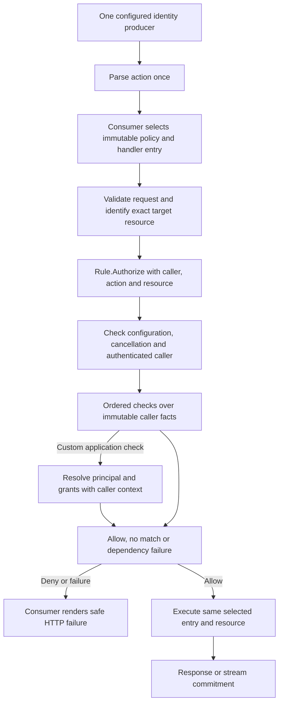

# 0021: Application authorization rules and dispatcher integration

Status: accepted;
rules, examples and local validation implemented.
The user approved Z1–Z7 on 2026-09-17.
Reviewed on 2026-09-16 against the implemented identity/authn/edge boundaries.

## Evidence and scope

Decisions 0012/0014 preserve immutable caller facts and distinguish missing or uninterpretable collections.
Decisions 0019/0020 establish one authenticated caller before application dispatch.
`action.go` already selects a header value without owning a dispatcher.
`authn/gateway_test.go` currently performs explicit consumer-owned authorization for both IAM and JWT callers.
This review replaces that ad hoc rule logic with reusable predicates, not an application framework.

Official AWS sources checked through the public AWS MCP documentation tools:

- [GetCallerIdentity](https://docs.aws.amazon.com/aws-sdk-php/v3/api/api-sts-2011-06-15.html): no permission to perform that operation is required;
  even an explicit deny does not prevent obtaining the identity information.
  Our STS proof cannot establish permission to invoke an application action or an execute-api route.
- [Cognito resource servers/scopes](https://docs.aws.amazon.com/cognito/latest/developerguide/cognito-user-pools-define-resource-servers.html): the resource server checks scopes for the protected operation.
  Scope strings identify permissions by application policy, not by a built-in edge action map.
- [Cognito groups](https://docs.aws.amazon.com/cognito/latest/developerguide/cognito-user-pools-user-groups.html): group membership and IAM-role assignment/selection are distinct mechanisms.
  A cognito:groups value is not itself an IAM permission or an application grant.
- [IAM role principals](https://docs.aws.amazon.com/IAM/latest/UserGuide/reference_policies_elements_principal.html): IAM can bind a role ARN in a policy to its unique principal ID, so deleting and recreating the role changes that trust relationship.
  Plain ARN/name comparisons in our library do not provide that protection or IAM policy evaluation.
- [Role paths](https://aws.amazon.com/blogs/security/how-to-enforce-creation-of-roles-in-a-specific-path-use-iam-role-naming-in-hierarchy-models/): role names are unique within an account even across paths.
  Paths remain part of IAM role ARNs;
  do not invent one from an STS session ARN.
- [AssumedRoleUser](https://docs.aws.amazon.com/STS/latest/APIReference/API_AssumedRoleUser.html) and [AssumeRole](https://docs.aws.amazon.com/cli/latest/reference/sts/assume-role.html): session identity includes the session name;
  it is not proof of the human or workload that originally obtained the role session.
  Existing identity validation already distinguishes the supported IAM principal forms.

[RFC 6750](https://www.rfc-editor.org/rfc/rfc6750.html#section-3) distinguishes authentication failure from insufficient privilege and specifies Bearer challenges.
Error/HTTP ownership must retain that distinction.
Official installed [Go context documentation](https://pkg.go.dev/context#Context), the previously loaded Go rules and Go 1.27 notes support explicit context-aware callbacks, consumer-owned interfaces and direct JSON v2 in response examples.

The old Beakley volume is not mounted at its recorded path in this session.
This review uses its persisted findings (especially dual-arm identity and glob matching) plus our current code;
no old source or tests were copied.

## Design graph



No rule reads an action header, changes identity, dispatches a handler or retries authentication.
Validation/selection order can vary, but the selected action, target and authorization result must govern the operation actually executed.

## Z1. Small concrete rules with explicit request facts

Recommend a stdlib/identity-only `authz` package with this initial core:

```go
type Request struct {
    Caller   identity.Caller
    Action   string
    Resource string
}

type CheckFunc func(context.Context, Request) (bool, error)
type Rule struct { /* private immutable configuration */ }

func Check(check CheckFunc) (Rule, error)
func All(rules ...Rule) (Rule, error)
func Any(rules ...Rule) (Rule, error)
func (r Rule) Authorize(ctx context.Context, request Request) error
```

Authorize returns nil only for an explicit allow.
Request is passed by value;
Caller is already immutable, and Action/Resource are exact strings.
Action must be nonempty UTF-8, without whitespace trimming or case normalization by authz.
Resource is optional UTF-8: an empty value means the policy does not require a resource identifier.
A resource-aware custom check must reject an absent target.
Resource is an application identifier, not automatically an ARN, path or URL.

Consumers populate these values after their own parsing/canonicalization.
The core does not read identity from context as a competing source: pass the already established caller explicitly.
It neither replaces caller context nor caches a permission result.
Construct rules once;
copies share private immutable nodes.
Custom callbacks must be concurrency-safe when rules are shared.

Reasoning: action dispatch is a primary consumer use case;
explicit action and target avoid hiding authorization parameters in context values.
A generic facts map, request body, http.Request dependency or exported mutable policy tree would add ownership and interpretation problems.
Consumers can define an Authorize interface where needed;
the producer need not export a redundant interface.

## Z2. Positive predicates with exact, issuer-qualified comparisons

Recommend these constructors, each returning `(Rule, error)`:

```go
func Sources(allowed ...identity.Source) (Rule, error)
func JWTSubject(issuer, subject string) (Rule, error)
func JWTClient(issuer, clientID string) (Rule, error)
func JWTScopes(issuer string, required ...string) (Rule, error)
func CognitoGroups(issuer string, required ...string) (Rule, error)
func IAMPrincipal(principalARN string) (Rule, error)
func IAMRoleSessions(partition, accountID, roleName string) (Rule, error)
```

JWTScopes and CognitoGroups require **all** supplied values.
Use Any of separate rules when one alternative suffices.
Constructors require nonempty identifiers, valid UTF-8 and at least one required value;
scopes use the existing OAuth scope-token grammar.
Duplicate set values may be deduplicated without changing spelling.
Empty or unknown source lists and SourceNone are invalid configuration.
Sources permits any one explicitly supplied nonanonymous source.

Wrong caller kind, missing facts and unavailable/flattened collections do not match.
A missing collection is not a network outage and does not become an empty set that can satisfy a negated rule.
Never split flattened Cognito groups or parse them as embedded JSON.
A literal scope such as `orders/*` is an exact scope name;
it does not authorize other scope strings.
Matching is case-sensitive.

Always qualify JWT subject/client/scope/group rules with exact issuer.
Client matching does not assert a machine grant;
subject matching does not establish a human identity.
Scopes, groups and resolved application grants never substitute for each other.
These rules use established facts;
they do not independently enforce token_use, signature, lifetime, revocation or audience.
Those remain the configured authentication producer's responsibility, including on gateway routes.
Combine rules when the application requires additional claim restrictions.

By default the predicates accept any supported producer of the matching kind.
Applications may put Sources in an outer All to restrict provenance.
Source is trusted-code attribution, not an unforgeable credential.
Do not silently exclude gateway/custom producers that the existing identity contract supports.
Sources alone is a broad allow for callers from those producers;
examples must combine it with the actual permission rule rather than present it as sufficient application authorization.

Alternative: bare scope/group/subject matching is shorter but permits accidental collisions across issuers.
Separate AnyScopes/AllScopes variants multiply the API;
the two general combinators provide the intended distinction.

## Z3. IAM exact principals and explicit role-session families

IAMPrincipal accepts the same supported caller ARN forms as identity.NewIAM and compares the entire ARN literally.
In particular:

- A root ARN matches that root caller only, not every principal in the account.
- A user path's literal `*` or `?` remains literal, following decision 0015.
- An assumed-role ARN matches the full session name, not all sessions of a role.
- Bare IAM role ARNs are not request-caller ARNs and are invalid here.

IAMRoleSessions is the explicit broader operation.
Require exact partition, twelve-digit account and a valid role name.
Match only an already validated assumed-role caller with those components and any valid session name.
Reject wildcard configuration and role paths;
do not replace `sts` with `iam` or return a reconstructed role ARN.
The authenticated caller retains its complete ARN.

This is a **role-name policy**.
Recreating a role with the same name/account can match again.
It does not bind a role's unique ID, identify the original human, evaluate a role's permission boundary/session policy, or prove execute-api permission.
Applications needing lifecycle-sensitive identity must resolve and compare their explicitly enrolled stable identifiers.
PrincipalID remains an optional opaque fact;
do not introduce automatic parsing into identity here.

No path.Match, regex, ARN glob engine, IAM policy parser, account-wide allow helper or inferred administrator/root override initially.
A custom check can express additional application policy explicitly.
This avoids reproducing the old separator/wildcard ambiguity while supporting practical varying sessions.

## Z4. Ordered combinators, with errors stopping evaluation

Recommend ordinary left-to-right short circuit evaluation:

| Operator | Child returns false, nil | Child returns true, nil | Child returns any error |
| --- | --- | --- | --- |
| All | Stop: no match | Continue; match after last child | Stop: failure |
| Any | Continue; no match after last child | Stop: match | Stop: failure |

An observed dependency failure never becomes a nonmatch followed by trying another permission path.
Discard a true result accompanied by an error.
Require nonempty combinators and valid child rules at construction;
never allow the vacuous truth of an empty All.
A zero Rule is unconfigured and cannot allow.

This is ordered evaluation: reordering may change work and error outcomes.
For example, Any(allow, unavailable) allows without calling its second child;
Any(unavailable, allow) fails.
This is intentional short circuit behavior, not a claim that all possible branch errors have been evaluated.
Keep mandatory tenant, suspension or revocation checks outside alternative allow branches:

`All(mandatoryApplicationGuard, Any(jwtPermissionPath, iamPermissionPath))`

Each alternative should start with cheap applicable identity restrictions before calling a provider.
No parallel evaluation, retries, hidden caching, or promises that callbacks execute for audit purposes.
Reusing a check in multiple evaluated positions can call it more than once;
callbacks must tolerate this.

Alternative: continue after an error to seek an independent allow improves some outage cases but can authorize after a failed application-policy dependency.
Evaluating every branch to give errors absolute precedence loses short-circuit isolation and can turn unrelated services into mandatory dependencies.
Prefer the ordered contract and explicit policy composition initially.

Do not add Not/None initially.
Without a richer missing-fact model, negating a failed match could authorize callers whose scopes/groups are unavailable.
Public/anonymous routes intentionally bypass authorization;
no AllowAll escape hatch is needed in the initial protected-route API.

## Z5. Sanitized outcomes and bounded evaluation

Recommend sentinels ErrInvalidConfiguration, ErrInvalidRequest, ErrUnauthenticated, ErrDenied and ErrUnavailable, inspected with errors.Is.
No public mutable Decision struct with an allow bit that can disagree with an error, and no raw callback error chain or claims in diagnostics.

Authorize checks configuration/non-nil context, then caller cancellation, request string validity, and a nonanonymous caller before invoking any check.
Anonymous requests always return ErrUnauthenticated;
even a permissive custom callback cannot authorize them.
A zero rule or nil check fails configuration validation.
A valid rule with a final nonmatch returns ErrDenied.

Custom checks use false,nil for ordinary denial.
**Any nonnil callback error is sanitized to ErrUnavailable**, including an internal context error while the request context remains live.
Callback-returned package sentinels do not bypass that contract.
Recheck caller cancellation between checks and before returning;
ctx.Err wins over results and provider diagnostics, never context.Cause.
Panics from trusted callbacks propagate;
do not disguise programmer bugs as denial.

Checks run synchronously with the caller's context.
Consumers own provider timeouts and must honor cancellation;
the library cannot preempt arbitrary Go code.
No goroutine per check and no callback invocation at construction.

Recommend maximum policy depth 32 and maximum 1,024 expanded node visits per constructed rule.
Count reused subtrees at every occurrence using checked arithmetic.
These are policy-configuration work bounds, not AWS limits or limits on callback internals.
Constructors copy supplied slices, reject oversized trees and permit immutable sharing.
No global policy registry or automatic logging.

## Z6. Application principal/grant resolution as a consumer-owned check

Recommend supporting resolution immediately through CheckFunc, while deferring a universal exported Principal/Grant/Resolver model until a concrete application schema is reviewed.
This is an explicit narrowing of the first authz milestone, not an implicit decision that token groups are sufficient application grants.

The consumer's check receives caller, action and resource.
It may resolve an application principal, tenant membership and resource-scoped grants in one context-aware service call.
It returns false,nil for a known unregistered, suspended or unauthorized principal, and an error when the decision cannot be made.
The server chooses which grant service is authoritative.
Never source these grants from caller-supplied headers or overwrite authenticated claims.

Use issuer plus subject for subject identity, issuer plus client_id for an explicitly supported client identity, and an intentionally chosen IAM enrollment key.
Do not fall back from a missing subject to treating client_id as a user;
do not infer human/M2M status from subject presence.
Account/session names and email addresses are not automatic global application-principal identifiers.

Keep one logical grant lookup inside one check.
The core does not guarantee deduplication across checks or install a second context principal.
If execution needs the resolved object, the application can resolve it once before invoking its policy and retain that immutable object in its own request execution plan.
An exported resolver/cache abstraction, grant wildcards and logging hooks need a later reviewed consumer requirement, rather than speculative fields now.

## Z7. HTTP ownership and action/resource consistency

Recommend no authz.Handler factory in the first cut.
Provide a runnable ordinary HTTP dispatcher example using existing authn middleware and ActionHeader.
The same registry entry owns its Rule and handler;
select it once, authorize its action/target, then execute that entry.
Unknown actions never fall through to an unprotected default.
The consumer chooses its 400/404 response policy.

This makes custom headers first-class through net/http without an additional header container, mutable context action or second action-parser callback.
Do not bind checks to rereadable raw headers.
Object-level authorization must use the same target object/version as execution;
transactional consistency for mutable application data remains the application's responsibility.

HTTP examples should distinguish:

| Outcome | HTTP treatment owned by the consumer |
| --- | --- |
| Unauthenticated | Ordinarily handled by authn's 401/challenges; gateway-only routes configure their own challenges |
| Authenticated denial | 403 |
| Authorization dependency unavailable | 503, no authentication challenge |
| Configuration/invalid authorization request | 500; parse bad client input earlier into an appropriate 4xx |
| Caller cancellation | Do not execute; best-effort 503, subject to transport cancellation |

For Bearer-protected resources, include the applicable Bearer challenge on denial as required by RFC 6750.
Use a generic realm challenge when the denial reason is not exposed;
insufficient_scope and a scope hint are only appropriate when the application can accurately describe that requirement.
Do not label every IAM/group/tenant denial as insufficient_scope or invent EdgeIAM OAuth parameters.
The core does not guess an authentication scheme from Caller.Kind.
Examples know their configured route authentication and own header formatting.

Preserve CORS headers, avoid credentials/identifiers in responses, and use direct JSON v2 for JSON examples.
An error response does not execute an action.
Finish authorization before any response commitment or streaming flush.
This proposal does not add mid-stream reauthorization or a framework-owned audit stream.

## Implementation and validation

Implemented on 2026-09-17 in `authz`: explicit request facts, immutable Check, All/Any, all seven predicate constructors, sanitized errors and policy tree bounds.
Production imports only the standard library and identity.
IAM policy configuration reuses identity.NewIAM's grammar;
the role-family constructor validates a sample session and never exposes or fabricates an IAM role ARN.

Contract tests cover the criteria below, including concurrent reuse, copied configuration, expanded shared-tree bounds, literal IAM paths/scopes, unavailable gateway collections, identity-source and issuer boundaries, callback error sanitization and cancellation.
Application fixtures verify grant lookup counts, 403 versus 503, safe JSON v2 envelopes and Bearer challenges, CORS preservation, and authorization/execution of the same action/resource despite header mutation.
Cognito signature verification and IAM-proof processing run before policy in native HTTP plus five raw/typed Gateway paths, using synthetic JWKS/STS responses.
Cancellation during policy evaluation is also checked across those paths.

Full race tests, vet, formatting and Linux arm64/amd64 builds pass on Go 1.27.1.
A 20-second policy fuzz run completed 45,257 cases without failure.
The [consumer guide](../authz.md) and [runnable examples](../../authz/example_test.go) document HTTP ownership, resource consistency and grant resolution.
No live AWS calls, deployment or GitHub CI run occurred.
Public streaming and generic principal/grant models remain deferred as described in this decision.

Completed acceptance criteria:

1. Implement core immutable rules, constructor validation and sanitized outcomes.
2. Add exact JWT/IAM/source predicates and ordered All/Any with bounded trees.
3. Test empty/zero/nil rules, anonymous/custom-check bypass attempts, source/kind gates, both callback result/error combinations, cancellation and error order.
4. Test unavailable gateway collections, cross-issuer collisions, literal scope punctuation, exact IAM paths/session/root, role/account/partition boundaries and explicit role-name recreation semantics.
   Fuzz policy input validation.
5. Add consumer-owned grant lookup and resource authorization fixtures, including 403 versus 503, zero provider calls for inapplicable branches, and no grants being injected into token identity.
   Test the exact selected action/target.
6. Exercise IAM and cryptographically verified Cognito callers with native HTTP plus raw/typed Gateway fixtures.
   Cover safe challenges and error envelopes.
7. Add the consumer guide/examples;
   run race/vet/Lambda builds.
   No live AWS calls.

## Resolution

The user approved Z1–Z7 on 2026-09-17.
The accepted choices are explicit action/resource inputs, exact issuer-qualified predicates, a deliberately named role-session-family check, ordered error-stopping combinators, and consumer-owned grant resolution and HTTP dispatch for the initial release.
These contracts are now implemented and locally validated without expanding the approved public API.
