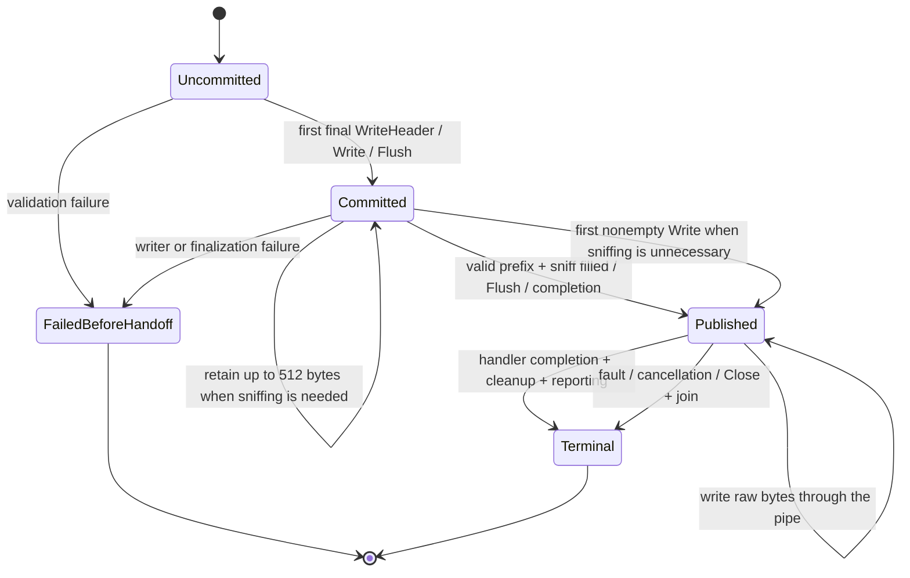

# 0022: Streaming writer completion and SDK compatibility review

Status: S1 and S2 approved by the user on 2026-09-17; implemented and locally validated.
S3 retains the existing deployment release gate. The user authorized completing
the streaming writer and approved public entry points under these refinements.

## Current boundaries and official evidence

Decisions 0009/0010 already approve the separate adapter, raw Handle and typed
HandleV1, one producer, bounded sniffing, multivalue JSON v2 metadata, handoff,
cleanup, Flush/FlushError and terminal-error reporting. Decision 0013 supplies
sanitized error categories; decision 0021 now supplies application authorization.

Implemented foundations are `stream.go`, `stream_encoding.go`,
`response_headers.go`, `adapter_invoke.go` and `invocation.go`. They provide the
bridge, framing, header ownership, request conversion, identity and cleanup.
The HTTP writer and approved public wiring are now implemented in
`streaming_writer.go` and `streaming_adapter.go`. No new event types,
authentication APIs or framework-owned dispatcher were needed.

Official documentation was checked through `aws-proxy-public` on 2026-09-17:

- [API Gateway streaming](https://docs.aws.amazon.com/apigateway/latest/developerguide/response-transfer-mode.html)
  remains REST-only for HTTP_PROXY/AWS_PROXY integrations, with transfer mode
  STREAM. Request streaming is unsupported. Gateway does not perform content
  encoding for streams; compression belongs in the integration. A disconnected
  client or timed-out connection need not stop Lambda execution.
- [Lambda proxy streaming format](https://docs.aws.amazon.com/apigateway/latest/developerguide/response-transfer-mode-lambda.html)
  requires InvokeWithResponseStream, the streaming integration URI, JSON metadata
  and eight NUL bytes followed by raw payload. Multivalue headers can carry every
  extra field, including cookies. If Content-Length and Transfer-Encoding are
  both absent, Gateway adds chunked transfer encoding.
- The same guide still leaves decimal/binary KB and delimiter start/end
  accounting unspecified. The approved 16,000-byte complete-prefix bound remains
  edge's conservative policy; there is no reason to reopen or relax it.
- [Lambda custom runtimes](https://docs.aws.amazon.com/lambda/latest/dg/runtimes-custom.html)
  still require the streaming-mode and chunked-encoding headers and closing the
  underlying response connection. Midstream errors use declared runtime trailers.

Both the Go module proxy and AWS's GitHub latest-release endpoint still report
[aws-lambda-go v1.55.0](https://github.com/aws/aws-lambda-go/releases/tag/v1.55.0),
published 2026-08-27, as latest stable. It is already required here; no dependency
update is needed. The downloaded SDK's runtime client and invoke loop were read.

Go rules, cached official Go 1.27 notes, and installed Go 1.27.1 godoc/source were
reviewed. [ResponseWriter](https://pkg.go.dev/net/http#ResponseWriter) permits
logical commitment before physical transmission and documents sniffing, header
suppression and buffered length inference.
[ResponseController.Flush](https://pkg.go.dev/net/http#ResponseController.Flush)
prefers FlushError over Flusher and can follow wrapper Unwrap methods. Source
comparisons used Go 1.27.1's GOROOT as reported by go env.

## State graph: applying existing approvals

Committed means the application's status/header snapshot cannot change.
Published means the bridge acknowledged reader ownership, not that the SDK or
remote client consumed a byte. This handoff determines the failure path.

The following apply the accepted design rather than reopen it:

1. WriteHeader freezes the response but need not publish. Empty Write commits
   200 if needed and accepts zero bytes without requiring publication or sniffing.
   Later ordinary header changes are ignored; trailer attempts remain faults.
2. Retain at most 512 bytes only when sniffing is needed. Publish when that prefix
   fills, explicitly flushes or the handler finishes. No timer, heartbeat or body
   queue. With a supplied/suppressed type or actual encoding, the first nonempty
   Write can publish immediately.
3. Flush commits 200 if needed, finalizes sniffing from pending bytes and drains
   them after publication. Empty Flush publishes without inventing a type; later
   writes cannot revise it. Repeated Flush without pending bytes only checks
   cancellation and recorded failure. It cannot promise client receipt or chunk
   boundaries. Compression wrappers must flush their encoder first.
4. FlushError returns failures. Flush uses the same implementation and retains
   failures for finalization. The first writer fault remains sticky if ignored.
   ResponseController-compatible wrappers preserve FlushError or Unwrap support.
5. One handler goroutine owns the writer. Header/Write/Flush are not promised
   concurrent safety; Read/Close synchronization remains the bridge's concern.
6. Validate a complete Write against declared length before copying/forwarding.
   Reject an overrun without forwarding its excess; retain accurate counts for
   partial pipe writes. Short non-HEAD bodies fail at completion, directly before
   handoff or terminally afterward. Reaching declared length does not mean the
   handler has completed or replace Flush as an explicit publication request.
7. HEAD accepts/counts representation writes but emits no body. Honor a supplied
   representation length without requiring an omitted HEAD body to fill it.
   Preserve the accepted 204/205/304 suppression and nonfatal ErrBodyNotAllowed
   behavior, including the documented 205 difference from net/http.
8. Before publication, faults return nil reader plus the classified error. After
   publication, no replacement status/body is possible; cleanup precedes terminal
   error/reporting. Existing operation/cleanup faults precede concurrent transport
   cancellation. This differs intentionally from authz's callback error boundary.
9. Reuse existing constructor/options rules and the approved streaming reporter.
   It receives the invocation context, not an inferred request principal. Factor
   request preparation without changing buffered semantics or original-body and
   multipart ownership. Default-off gateway identity and inherited-caller
   rejection apply to streaming too.
10. Raw Handle rejects explicitly versioned HTTP API envelopes. Typed V1 cannot
    prove REST deployment configuration. Preserve that qualification and the SDK
    capture-versus-edge JSON v2 distinction in registration examples.

## S1. Accepted: never infer streaming Content-Length

Earlier approvals prohibit whole-body buffering and inference after handoff,
but do not settle whether a tiny response completing before handoff should gain
an inferred length. Buffered edge and native net/http can infer one.

**Recommend:** preserve valid caller-supplied Content-Length when the method and
status permit it; otherwise omit it consistently, including small completed
responses, empty responses and HEAD. Respect explicit suppression. Do not generate
Transfer-Encoding metadata; Gateway owns its transport framing.

**Reasoning:** AWS explicitly supports omitted length. Inferring it only before
publication makes output depend on sniffing, Content-Type presence and Flush
placement. One rule keeps small and large responses on a predictable streaming
contract without extra buffering or configuration.

**Alternative:** infer from the small prefix on successful completion before
handoff, closer to net/http's optimization. This saves chunk framing in some
cases but creates timing-dependent headers and an additional HEAD rule.

**Consequence:** an unflushed tiny stream may omit a length that buffered edge or
native HTTP would infer. Applications needing a representation length supply
one explicitly. Buffered behavior is unchanged. This is edge policy, not an AWS
prohibition on inferred lengths.

## S2. Accepted: share a nonblank Content-Encoding sniffing test

Before this refinement, `bufferedWriter.finish` suppressed sniffing when Content-Encoding
has any values, including a single empty string. Go 1.27.1 checks for a nonblank
encoding. The local HTTP probe confirms an empty Content-Encoding permits HTML
content detection, while an actual encoding suppresses it.

**Recommend:** use a small shared private predicate in both writers. Suppress
sniffing if any committed, trimmed Content-Encoding value is nonempty. Nil/empty
slices and all-empty values do not suppress it. Preserve the field through
existing snapshot rules, without introducing an encoding grammar parser.
Content-Type's explicit nil/empty-slice suppression remains unchanged.

**Reasoning:** an empty encoding does not say the bytes are encoded. Conversely,
a later nonempty repeated value must still suppress sniffing even if the first
value is blank; looking only at Header.Get misses that defensive multivalue case.
One helper prevents drift between the two writers.

**Alternative:** retain the any-value check in both writers. It preserves the
current edge quirk but loses intended Go compatibility for empty encoding fields.
A universal encoding parser would be unnecessary additional scope.

**Consequence:** buffered responses with absent Content-Type and explicitly empty
Content-Encoding may now gain a detected type. Actual encodings, explicit type
suppression and header representation remain unchanged. This compatibility
correction was approved on 2026-09-17.

## S3. SDK issue: retain the existing deployment release gate

All five existing local Runtime API cases were rerun with race detection against
v1.55.0. They still show incremental raw/typed delivery, reader closure and late
error trailers. Edge's byte-plus-error normalization remains necessary to preserve
data that the SDK's errorCapturingReader otherwise discards.

The extended probe also observes:

- Lambda-Runtime-Function-Response-Mode is absent.
- The response request does not ask to close its connection.
- All five cases reused the response TCP connection for the subsequent /next
  request. Closing the returned io.ReadCloser is distinct from closing that
  Runtime API connection.

Both observations differ from the current custom-runtime guide. The mock accepts
them to observe SDK behavior. This proves neither rejection nor successful
streaming by the real Lambda/API Gateway services.

[Upstream issue 500](https://github.com/aws/aws-lambda-go/issues/500) raised the
mode-header question. Collaborator comments support the reader/lambdaurl design
but do not answer it. Closing that issue does not resolve the mismatch or verify
today's REST API Gateway behavior.

**Recommendation remains SDK reuse.** Continue the locally testable implementation
after S1/S2 approval, retaining the deployment gate for both header and connection
handling. Do not patch the module cache, change global HTTP transport, fork the SDK
or add a custom runtime as an implicit workaround.

Resolution still needs authoritative AWS clarification, a suitable stable SDK
change or a separately approved deployed integration test. Such a test should
check client-observed incremental delivery and truncation/error behavior with the
exact SDK and REST integration configuration. This review used no account APIs,
deployments or upstream posts. Deployment support remains unverified.

## Implementation sequence and validation

1. Record S1/S2 resolution, then add the shared predicate and focused
   buffered regressions before implementing streaming sniffing.
2. Implement the private writer over the existing bridge, testing split sniffing,
   suppression, empty writes/flushes, publication, lengths, bodyless responses,
   sticky faults, late trailers and panics.
3. Factor shared preparation and wire the approved constructor, reporter and
   raw/typed REST entry points.
4. Exercise the actual edge writer through the SDK subprocess: first delivery
   before producer completion, backpressure, cleanup/Close and invocation reuse.
5. Add SSE, direct JSON v2 NDJSON, binary and gzip examples, slow readers/early
   closure and authn/authz denials/outages before commitment. Heartbeats and
   application error records remain consumer-owned.
6. Run race tests, vet, formatting and both Lambda builds. Report local completion
   separately from deployment compatibility.

The initial review changed only documentation and local observation probes. The Go
1.27.1 HTTP reference probe passes for nil/empty/actual Content-Encoding,
Content-Type suppression and empty Flush. The latter publishes without a type
or inferred length. Both reference and SDK probes pass with race detection.
The user subsequently approved S1/S2 and authorized implementation on 2026-09-17.
Existing accepted contracts and the deployment qualification stay in force.

## Implementation completed on 2026-09-17

The writer, constructor, raw/typed REST methods and terminal reporter are now
implemented. Shared preparation reuses buffered request validation, body ownership
and opt-in native identity. Both writers use the approved sniffing predicate;
streaming consistently omits inferred lengths. The writer retains at most 512
sniff bytes and uses the existing bridge for handoff and backpressure.

Contract tests cover split sniffing, header ownership, empty writes/flushes,
explicit/suppressed type, encoding, lengths, HEAD/bodyless statuses, sticky faults,
prefix/header bounds, partial writes, trailers, early/late panics, cancellation,
Close, reporter faults, multipart cleanup and concurrent identity isolation.
An 8 MiB body test proves the streaming path does not apply the buffered envelope
limit. Existing Cognito/IAM authentication, authorization and cancellation matrices
now include both streaming entry points.

The SDK subprocess suite has nine cases, including the production raw/typed
adapter and its late length error/panic paths. The local Runtime API server reads
the first body segment before releasing the producer, testing delivery beyond
metadata. It checks reader closure before the next invocation. The mode-header
and connection-reuse observations remain; successful mock delivery does not
resolve S3.

SSE, direct JSON v2 NDJSON, binary and gzip examples are runnable. Full module
race tests, vet, formatting, and Linux arm64/amd64 builds pass on Go 1.27.1.
See the [consumer guide](../streaming.md). No AWS deployment or account API was
used, and no SDK workaround was introduced.

## Documentation and SDK follow-up

The user's requested [2026-09-17 follow-up](../reviews/2026-09-17-sdk-streaming-follow-up.md)
rechecks current AWS docs, version-specific SDK Go docs and upstream discussions.
All direct AWS dependencies remain latest stable. A tenth probe case now returns
the SDK's APIGatewayProxyStreamingResponse directly and reproduces the missing
mode header and connection reuse without edge's adapter or encoder. The SDK's
explicit REST streaming documentation strengthens the intended-support evidence,
but the transport discrepancy remains unresolved. The follow-up includes a draft
of six precise questions for the user to send to AWS. No production policy changes.
