# 0023: Consumer readiness and the next implementation milestone

Status: proposed on 2026-09-20. The user authorized this design review, not the
dependent public API or release-policy changes below. R1–R6 await review.

## Outcome and scope

The public packages already compose into the intended HTTP, authentication and
authorization pipeline. This review found no missing root facade or dispatcher
interface needed to demonstrate that composition. The next useful deliverable
is one complete consumer application with tests and a clear support matrix.

The significant proposed refinement is to defer exporting `edgetest`. It is in
the original package plan, but no concrete helper API was previously accepted.
Existing identity constructors, standard httptest tools, explicit SDK event
literals and local provider transports already cover the basic test boundaries.
Prove the remaining repetition in the reference application before freezing a
new exported fixture API.

This is a consumer composition and release-readiness review, not a new security
audit or a claim of deployed AWS interoperability. The Beakley comparison below
uses the nine findings preserved in the implementation plan; it does not assert
an exhaustive new source/API parity review of Beakley.

## Evidence inspected

- `authz/example_test.go` composes ActionHeader, Cognito configuration, IAM proof
  verification/error mapping, ordered rules and application grant resolution.
  Its runnable dispatcher example exercises missing credentials, not both
  successful credential paths or Lambda registration.
- `authn/example_test.go` demonstrates a successful synthetic Bearer path and a
  rejected proof. `iamproof/example_test.go` demonstrates client proof generation.
  Registration and streaming examples live in separate root-package files.
- `authn/gateway_test.go` and `authn/authorization_test.go` exercise production
  Cognito signature verification and IAM proof processing with synthetic local
  JWKS/STS dependencies across native HTTP, five buffered entry formats and two
  REST streaming entry points. This is stronger composition coverage than the
  short consumer examples, but it is spread through test-only helpers.
- `authn.Authenticator.Handler` deliberately writes generic text failures.
  Custom JSON failures are supported through Authenticate, Error.StatusCode,
  Error.Challenges and identity.WithCaller, but the custom-envelope example only
  demonstrates its failure branch. A complete success/error pipeline is missing
  from the consumer walkthrough.
- `identity.NewJWT`, NewIAM and WithCaller already validate and construct fixture
  facts. The adapter and authenticator reject inherited callers. A convenience
  fixture must not quietly bypass that boundary or imply cryptographic proof.
- Public root godoc, package imports, README, guides, fixture inventory, current
  CI workflow and decisions 0005/0011/0018–0022 were inspected.

Official documentation and Go skills checked for this review:

- [AWS HTTP API payload differences](https://docs.aws.amazon.com/apigateway/latest/developerguide/http-api-develop-integrations-lambda.html),
  through public AWS MCP: 2.0 combines repeated header/query values, handles
  cookies separately, and omits the custom-domain API mapping from rawPath.
- [REST proxy input/output](https://docs.aws.amazon.com/apigateway/latest/developerguide/set-up-lambda-proxy-integrations.html),
  through public AWS MCP: multivalue maps, deployment-dependent requestContext
  and distinct IAM/Cognito/custom-authorizer assertions.
- Installed Go 1.27.1 godoc via go-docs for httptest.NewRequestWithContext and
  ResponseRecorder.Result. The former invents test host/protocol defaults and
  dummy TLS state for HTTPS; the latter is a buffered observation whose body
  does not report late streaming failures. Neither simulates API Gateway.
- Go rules for API design, testing, errors, packages and runnable examples,
  together with the previously loaded official Go 1.27 release notes.
- [Go release workflow](https://go.dev/doc/modules/release-workflow) and
  [module source layout](https://go.dev/doc/modules/managing-source). A v0
  milestone can precede API stability; v1 establishes compatibility commitments.

## R1. Build one complete reference application with existing APIs

**Recommendation:** add a reference application under `examples/dispatcher`,
with shared application code internal to that example and small explicit native,
buffered Lambda and REST streaming entry points. Keep it in the root module so
normal tests and builds include it. Add an external-module compile check using
a local replace directive to verify consumption through public imports.

Use a small orders domain and the configured Action header. The complete
pipeline should be visible in one place:

```mermaid
flowchart LR
    Transport[Native HTTP or edge adapter] --> Routes[Explicit public routes and CORS preflight]
    Routes --> Authenticate[Select and verify Bearer or EdgeIAM]
    Authenticate --> Caller[Install one caller]
    Caller --> Select[Parse action and select registry entry once]
    Select --> Target[Resolve and validate resource]
    Target --> Authorize[Check identity policy and application grant]
    Authorize --> Execute[Execute the same entry and resource]
    Execute --> Output[JSON response or explicitly configured REST stream]
```

Show actual CognitoVerifier and iamproof.Verifier wiring, including the required
ErrInvalidProof-to-ErrInvalidCredentials mapping. Use Authenticate for consistent
application-owned JSON errors, preserve challenges/no-store/CORS and install the
caller only on success. Keep public routes/preflight explicit. Do not change the
existing convenience middleware's text response policy.

Use a normal read action across all transports. Register a streaming action only
in the streaming application variant; do not select adapter mode from a header,
detect it with a failed Flush, or imply HTTP APIs support response streaming.
Authorize before the first write/flush. Stop on context/write/flush failures.
Grant storage and action/resource consistency remain application-owned.

**Alternative:** add an edge dispatcher/resolver/error-rendering framework.
**Reasoning:** the existing public APIs already support the composition, and
decision 0021 deliberately keeps application policy and dispatch with consumers.
**Consequence:** the example contains some explicit wiring; its application
types and configuration are not new module-wide public contracts.

## R2. Defer exported edgetest helpers until the example proves their value

**Recommendation:** the next milestone adds no exported edgetest API. Start with
private fixture helpers in the example's tests and a consumer-testing guide.
This is a proposed change to the original sequencing, requiring user approval.

The smallest test vocabulary currently needed is already available:

| Test boundary | Existing tools | What the test does not prove |
| --- | --- | --- |
| Business authorization | identity constructors, authz.Request/Rule | Credential verification |
| Handler after authentication | httptest plus explicitly installed fixture caller | Adapter/authn admission of that caller |
| Full authn pipeline | Real verifier plus test-local JWKS/STS transport | AWS acceptance of synthetic credentials |
| Gateway conversion | Explicit SDK events or authored raw JSON and public adapter | Deployed routing/authorizer configuration |
| Incremental stream | Public streaming reader, controlled producer/consumer, Close | Remote client timing or AWS termination semantics |

For native business-handler tests, use SourceCustomAssertion unless the test
specifically models a different source. Do not inject a caller into the parent
context passed to the adapter or authenticator. Provider stubs may return the
required verified-source fixture only when explicitly labeled as stubs; real
cryptographic/proof tests use the real verifiers with local dependencies.

Keep distinct private REST, HTTP API 1.0 and HTTP API 2.0 fixtures. SDK V1 lacks
the raw version discriminator, so HTTP 1.0 raw fixtures must explicitly encode
`version: "1.0"` using JSON v2. Do not infer API product from the V1 Go type.
Avoid generic HTTP-request-to-Gateway conversion: an ordinary request lacks
deployment mapping, authorizer output and the original Gateway field choices.

**Alternatives considered:** exported NewJWT/NewIAM convenience wrappers;
REST/HTTPV1/HTTPV2 JSON-marshaling wrappers; a universal request builder;
response collectors returning a common http.Response. The first two mostly
duplicate existing APIs. The latter two introduce fidelity, error, resource and
ownership policies that have not earned a public compatibility commitment.

**Reasoning:** tests should expose meaningful protocol differences. A helper
that normalizes away repeated headers, claims fidelity or late read errors can
make incorrect application assumptions appear valid.
**Consequence:** some small explicit fixture construction remains. Revisit
exported helpers after the reference application and an actual consumer identify
a stable repeated operation; review exact signatures and policy at that point.

## R3. Demonstrate realistic consumer outcomes, preserving fixture provenance

**Recommendation:** test the reference application's public boundary with both
successful credential kinds, rather than only adding more constructor examples.
Keep the current transport fixtures as independent adapter contract tests.

Acceptance for the reference application:

- Both credential kinds can execute the same authorized action/resource.
- Missing/rejected credentials, duplicate Authorization or Action, unknown
  action, grant denial, grant outage and cancellation produce the selected safe
  outcomes; denied requests never execute. Preserve challenges and CORS.
- Resource resolution/authorization/execution use the same selected target.
- Normal actions work through native HTTP and all supported buffered formats;
  streaming examples additionally demonstrate first delivery before completion,
  a slow reader, early Close and a late failure after successful authorization.
- Custom consumer headers survive; meaningful multivalue/cookie/binary cases
  remain visible instead of being hidden by a universal response normalizer.
- Test dependencies cannot accidentally fall through to live AWS/network calls.
  Test keys and STS responses are synthetic and explicitly described that way.

**Alternative:** export fixture machinery first or treat passing package tests
as a complete consumer walkthrough. **Reasoning:** existing tests establish
composition, but consumers still have to assemble the successful production
configuration and consistent error handling from several files.
**Consequence:** no new authentication guarantees or relaxed source checks.

## R4. Publish a precise initial support matrix and retain deferred scope

**Recommendation:** document what is implemented, locally tested, deferred and
deployment-unverified separately. Retain custom Lambda-authorizer mapping,
Gateway metadata accessors, mTLS identity, Function URLs/ALB, generic grant
resolvers and ongoing stream reauthorization outside this initial milestone.
No current required consumer case justifies silently introducing their contracts.

The root package currently exposes no Gateway request-ID/stage/route accessor.
Decision 0005 explicitly deferred that API. The plan's broad package-responsibility
description must not be read as a claim that every metadata field is available.
Custom authorizers are not native IAM/Cognito/JWT assertions and remain rejected
when encountered by opt-in identity extraction under the accepted rules.

**Alternative:** expand the next milestone to all deferred integrations.
**Reasoning:** each has independent representation and trust-boundary questions.
**Consequence:** feature exclusions become explicit consumer information, and
any specific unmet consumer requirement returns for its own design review.

### Original Beakley failure cases traced to current coverage

| Preserved finding | Implemented response and representative evidence |
| --- | --- |
| Unverified header JWT reconciled with gateway identity | No fallback/mixing; gateway recognition/conflict tests, authn context/source tests, Cognito signature tests |
| Repeated status/header mutation changed committed output | Buffered commitment tests and TestStreamingWriterCommitmentAndSniffing |
| V1 path delimiters interpreted as query/fragment | TestRequestPathsMatchHTTPParsing and decoder fixture rest.json |
| Single-value maps discarded by unrelated multivalue maps | TestRequestMergingAndOwnership and cross-format action-header tests |
| Simultaneous IAM/JWT arms could authorize | Immutable caller union; TestGatewayRecognitionMatrix conflicts; mandatory authz guard |
| Cold JWKS outage caused repeated fetches | TestCognitoColdFetchSharingAndBackoff and cancellation/rotation tests |
| Anonymous fixture blocked later verification | Anonymous WithCaller is a no-op; inherited nonanonymous caller rejects; context and transport tests |
| Broad ARN wildcard matching | TestIAMExactAndRoleFamilies and validated IAM caller forms; no glob matcher |
| Client ID/audience conflation and unrestricted clients | TestCognitoClientAudienceAndClaims and required explicit client configuration |

These map the recorded defects to contracts/tests, not to a claim that AWS
produces every synthetic fixture or that Beakley's entire API was copied.

## R5. Complete release engineering before a first v0 milestone

**Recommendation:** prepare a v0 consumer milestone after the example and review
are complete. Do not claim v1 stability yet. Keep the streaming deployment
qualification in force and track real Cognito/STS interoperability separately.
Authoritative AWS answers or an approved live fixture are still needed for the
streaming transport questions; local tests cannot close that item.

Current readiness observations:

- Five public packages exist: edge, identity, authn, authz and iamproof.
  Identity remains standard-library-only; authn/authz depend on identity and the
  standard library. AWS dependencies stay in transport and iamproof.
- The identity package's encoding/json import is only for Number compatibility;
  module-owned JSON processing remains direct JSON v2/jsontext.
- CI defines Go 1.27.0/latest 1.27 tests/race/vet and Linux arm64/amd64 builds.
  Referenced checkout@v7 and setup-go@v7 tags resolve. No GitHub CI result is
  recorded for this working branch; local success does not establish it.
- The historical nested `docs/probes/iamproof` module is excluded from root
  `go test ./...`. Label it historical or run it explicitly when relying on its
  evidence. Keep new runnable consumer examples in the root module.
- Initial buffered allocation baselines exist. Add a streaming baseline that
  consumes incrementally and excludes fixture setup; record environment and
  allocations, without inventing performance thresholds or Lambda latency claims.
- All direct AWS modules are still latest stable on 2026-09-20. Indirect
  smithy-go v1.28.2 is now available, released 2026-09-18, versus required v1.28.1.
  Its [upstream comparison](https://github.com/aws/smithy-go/compare/v1.28.1...v1.28.2)
  includes HTTP path/host and event-stream/decoder changes. Recommend an isolated
  patch update with IAM-proof contract tests, full race/vet and target builds.
  This is not a fix for aws-lambda-go's separate streaming transport.
- A newer testify appears in the module graph through upstream SDK tests, not
  this module's production imports. Do not blanket-update all listed modules.

**Alternative:** declare release readiness from local unit tests alone.
**Reasoning:** the reference application, CI execution and accurate support
claims validate different consumer concerns. **Consequence:** prepare these
artifacts locally; pushing, tagging, publishing and deploying are separate actions.

## R6. Obtain the owner's distribution/license choice before publication

There is no tracked LICENSE/COPYING/NOTICE file in this repository. No existing
organization license was supplied by the task, and public/private repository
visibility was not investigated by this review.

**Recommendation:** use the owner's existing organization-standard license if
one applies, with the exact license and copyright holder confirmed by the owner.
Otherwise defer external publication until that choice is made. Do not infer a
license from dependencies or Beakley, and do not change repository visibility.

**Alternative:** choose a license during technical implementation.
**Reasoning:** this is an ownership/distribution decision, not an adapter API
default. **Consequence:** it does not block the example or local validation.
The exact license remains an open owner question, even if R1–R5 are approved.

## Validation and next execution order

On Go 1.27.1 darwin/arm64, the current implementation passes `go test -race ./...`,
`go vet ./...`, `go mod verify` and CGO-disabled Linux arm64/amd64 builds.
This review changes documentation only. It does not implement a new package,
update dependencies, publish a release or contact AWS.

After approval: build/test the reference application and consumer-testing guide;
reconcile support/status documentation; make the isolated Smithy patch update;
record streaming baselines and prepare CI/release evidence. Resolve any new
public API or trust-boundary decision before implementing it. The existing AWS
questions can proceed independently through the user's outreach.
